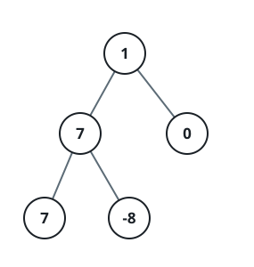

# Maximum Level Sum of a Binary Tree

## Description

Given the `root` of a binary tree, the level of its root is `1`, the level
of its children is `2`, and so on.

Return the smallest level `x` such that the sum of all the values of nodes
at level `x` is maximal.

### Example 1



```text
Input: root = [1,7,0,7,-8,null,null]
Output: 2
Explanation:
Level 1 sum = 1.
Level 2 sum = 7 + 0 = 7.
Level 3 sum = 7 + -8 = -1.
So we return the level with the maximum sum which is level 2.
```

### Example 2

```text
Input: root = [989,null,10250,98693,-89388,null,null,null,-32127]
Output: 2
```

### Constraints

- The number of nodes in the tree is in the range `[1, 10⁴]`.
- `-10⁵ <= Node.val <= 10⁵`

## Hints

### Hint 1

Calculate the sum for each level then find the level with the maximum sum.

### Hint 2

How can you traverse the tree?

### Hint 3

How can you sum up the values for every level?

### Hint 4

Use DFS or BFS to traverse the tree keeping the level of each node, and sum
up those values with a map or a frequency array.
