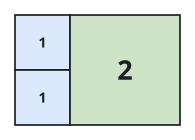
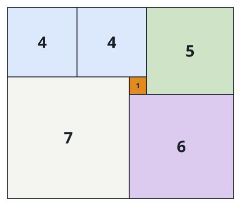

# Tiling a Rectangle with the Fewest Squares

## Description

Given a rectangle of size `n x m`, return the minimum number of integer-sided
squares that tile the rectangle.

### Example 1



```text
Input: n = 2, m = 3
Output: 3
Explanation: 3 squares are necessary to cover the rectangle: 2 squares of 1x1 and 1 square of 2x2.
```

### Example 2


```text
Input: n = 5, m = 8
Output: 5
```

### Example 3



```text
Input: n = 11, m = 13
Output: 6
```

### Constraints

- `1 <= n, m <= 13`

## Hints

### Hint 1

Can you use backtracking to solve this problem?

### Hint 2

Suppose you've placed a bunch of squares. Where is the natural spot to place
the next square?

### Hint 3

The maximum number of squares to be placed will be `<= max(n, m)`.
