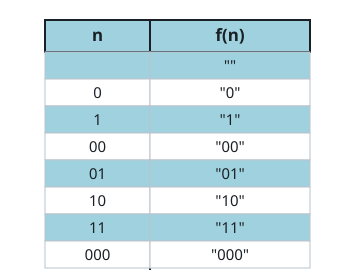

# Encode Number

## Description

Given a non-negative integer `num`, return its encoding string.

The encoding is done by converting the integer to a string using a secret
function that you should deduce from the following table:

```text
num -> encoded
  0 -> ""
  1 -> "0"
  2 -> "1"
  3 -> "00"
  4 -> "01"
  5 -> "10"
  6 -> "11"
  7 -> "000"
```



### Example 1

```text
Input: num = 23
Output: "1000"
```

### Example 2

```text
Input: num = 107
Output: "101100"
```

### Constraints

- `0 <= num <= 10^9`

## Hints

### Hint 1

Try to find the number of binary digits returned by the function.

### Hint 2

The pattern is to start counting from zero after determining the number of
binary digits.
