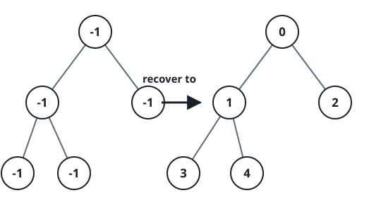

# Find Elements in a Contaminated Binary Tree

## Description

Given a binary tree with the following rules:

- `root.val == 0`
- For any tree node:
    - If `treeNode.val` has a value `x` and `treeNode.left != null`, then
      `treeNode.left.val == 2 * x + 1`.
    - If `treeNode.val` has a value `x` and `treeNode.right != null`, then
      `treeNode.right.val == 2 * x + 2`.

Now the binary tree is contaminated, which means all `treeNode.val` have been
changed to `-1`.

Implement the `FindElements` class:

- `FindElements(TreeNode root)` initializes the object with a contaminated
  binary tree and recovers it.
- `bool find(int target)` returns `true` if the `target` value exists in the
  recovered binary tree.

### Example 1


```text
Input:
["FindElements","find","find"]
[[[-1,null,-1]],[1],[2]]
Output: [null,false,true]
Explanation: FindElements findElements = new FindElements([-1,null,-1]);
findElements.find(1); // return False
findElements.find(2); // return True
```

### Example 2



```text
Input:
["FindElements","find","find","find"]
[[[-1,-1,-1,-1,-1]],[1],[3],[5]]
Output: [null,true,true,false]
Explanation: FindElements findElements = new FindElements([-1,-1,-1,-1,-1]);
findElements.find(1); // return True
findElements.find(3); // return True
findElements.find(5); // return False
```

### Example 3


```text
Input:
["FindElements","find","find","find","find"]
[[[-1,null,-1,-1,null,-1]],[2],[3],[4],[5]]
Output: [null,true,false,false,true]
Explanation: FindElements findElements = new FindElements([-1,null,-1,-1,null,-1]);
findElements.find(2); // return True
findElements.find(3); // return False
findElements.find(4); // return False
findElements.find(5); // return True
```

### Constraints

- `TreeNode.val == -1`
- The height of the binary tree is less than or equal to `20`.
- The total number of nodes is between `[1, 10^4]`.
- Total calls of `find()` is between `[1, 10^4]`.
- `0 <= target <= 10^6`

## Hints

### Hint 1

Use DFS to traverse the binary tree and recover it.

### Hint 2

Use a hashset to store `TreeNode.val` for finding.
