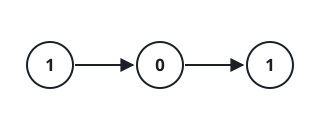

# Convert Binary Number in a Linked List to Integer

## Description

Given `head` which is a reference node to a singly-linked list. The value
of each node in the linked list is either `0` or `1`. The linked list
holds the binary representation of a number.

Return the decimal value of the number in the linked list.

The most significant bit is at the head of the linked list.

### Example 1



```text
Input: head = [1,0,1]
Output: 5
Explanation: (101) in base 2 = (5) in base 10
```

### Example 2

```text
Input: head = [0]
Output: 0
```

### Constraints

- The Linked List is not empty.
- Number of nodes will not exceed 30.
- Each node's value is either `0` or `1`.

## Hints

### Hint 1

Traverse the linked list and store all values in a string or array.
Convert the values obtained to decimal value.

### Hint 2

You can solve the problem in O(1) memory using bits operation. Use shift
left operation (`<<`) and or operation (`|`) to get the decimal value in
one operation.
