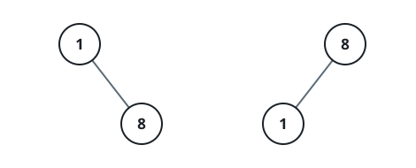

# All Elements in Two Binary Search Trees

## Description

Given two binary search trees root1 and root2, return a list containing all the integers from both trees sorted in ascending order.

### Example 1


```text
Input: root1 = [2,1,4], root2 = [1,0,3]
Output: [0,1,1,2,3,4]
```

### Example 2



```text
Input: root1 = [1,null,8], root2 = [8,1]
Output: [1,1,8,8]
```

### Constraints

- The number of nodes in each tree is in the range `[0, 5000]`.
- `-10⁵ <= Node.val <= 10⁵`

## Hints

### Hint 1

Traverse the first tree in list1 and the second tree in list2.

### Hint 2

Merge the two trees in one list and sort it.
