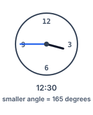
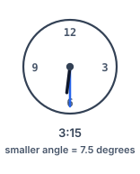

# Angle Between Hands of a Clock

## Description

Given two numbers, hour and minutes, return the smaller angle (in degrees) formed between the hour and the minute hand.

Answers within 10-5 of the actual value will be accepted as correct.

### Example 1



```text
Input: hour = 12, minutes = 30
Output: 165
```

### Example 2


```text
Input: hour = 3, minutes = 30
Output: 75
```

### Example 3



```text
Input: hour = 3, minutes = 15
Output: 7.5
```

### Constraints

- `1 <= hour <= 12`
- `0 <= minutes <= 59`

## Hints

### Hint 1

The tricky part is determining how the minute hand affects the position of the hour hand.

### Hint 2

Calculate the angles separately then find the difference.
