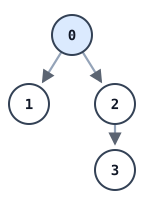
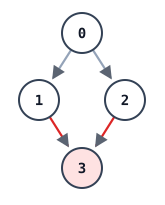
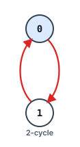

# Validate Binary Tree Nodes

## Description

You have n binary tree nodes numbered from 0 to n - 1 where node i has two children leftChild[i] and rightChild[i], return true if and only if all the given nodes form exactly one valid binary tree.

If node i has no left child then leftChild[i] will equal -1, similarly for the right child.

Note that the nodes have no values and that we only use the node numbers in this problem.

### Example 1



```text
Input: n = 4, leftChild = [1,-1,3,-1], rightChild = [2,-1,-1,-1]
Output: true
```

### Example 2



```text
Input: n = 4, leftChild = [1,-1,3,-1], rightChild = [2,3,-1,-1]
Output: false
```

### Example 3



```text
Input: n = 2, leftChild = [1,0], rightChild = [-1,-1]
Output: false
```

### Constraints

- `n == leftChild.length == rightChild.length`
- `1 <= n <= 10⁴`
- `-1 <= leftChild[i], rightChild[i] <= n - 1`

## Hints

### Hint 1

Find the parent of each node.

### Hint 2

A valid tree must have nodes with only one parent and exactly one node with no parent.
