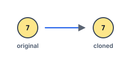

# Find a Corresponding Node of a Binary Tree in a Clone of That Tree

## Description

Given two binary trees `original` and `cloned`, and given a reference to a node
`target` in the original tree.

The cloned tree is a copy of the original tree.

Return a reference to the same node in the cloned tree.

Note that you are not allowed to change any of the two trees or the target
node, and the answer must be a reference to a node in the cloned tree.

Because node references cannot cross the judge boundary, this adaptation passes
the target by value: `target` is the integer value of the target node, values
are unique, and the answer is reported as the subtree of the cloned tree rooted
at the corresponding node (serialized in level order).

### Example 1


```text
Input: tree = [7,4,3,null,null,6,19], target = 3
Output: [3,6,19]
Explanation: The answer is the subtree of the cloned tree rooted at the node
with value 3.
```

### Example 2



```text
Input: tree = [7], target = 7
Output: [7]
```

### Example 3


```text
Input: tree = [8,null,6,null,5,null,4,null,3,null,2,null,1], target = 4
Output: [4,null,3,null,2,null,1]
```

### Constraints

- The number of nodes in the tree is in the range `[1, 10^4]`.
- The values of the nodes of the tree are unique.
- `target` is the value of a node from the original tree.

### Follow up

Could you solve the problem if repeated values on the tree are allowed?

## Hints

### Hint 1

Traverse both trees in parallel: when the original walk reaches the target
value, the same position in the cloned tree is the answer.
