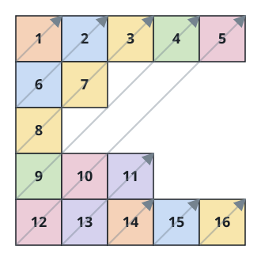

# Diagonal Traverse II

## Description

Given a 2D integer array `nums`, return all elements of `nums` in
diagonal order as shown in the below images.

The traversal visits the diagonals in order of `i + j` — the diagonal
`i + j = 0` first, then `i + j = 1`, and so on — and within each diagonal
it visits the cells from the higher row index down to the lower one.
Rows may have different lengths: `nums` is ragged, and a cell exists only
where its row is long enough.

### Example 1


```text
Input: nums = [[1,2,3],[4,5,6],[7,8,9]]
Output: [1,4,2,7,5,3,8,6,9]
```

### Example 2



```text
Input: nums = [[1,2,3,4,5],[6,7],[8],[9,10,11],[12,13,14,15,16]]
Output: [1,6,2,8,7,3,9,4,12,10,5,13,11,14,15,16]
```

### Constraints

- `1 <= nums.length <= 10⁵`
- `1 <= nums[i].length <= 10⁵`
- `1 <= sum(nums[i].length) <= 10⁵`
- `1 <= nums[i][j] <= 10⁵`

## Hints

### Hint 1

Notice that numbers with equal sums of row and column indexes belong to
the same diagonal.

### Hint 2

Store them in tuples `(sum, row, val)`, sort them, and then regroup the
answer.
