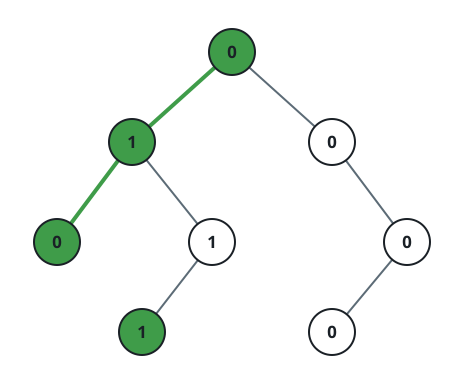
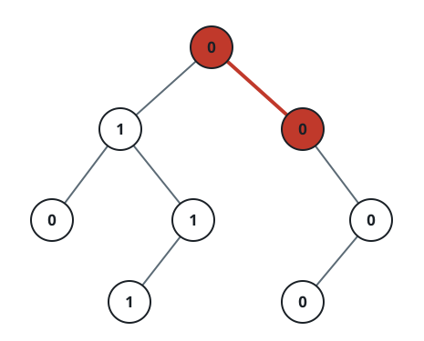
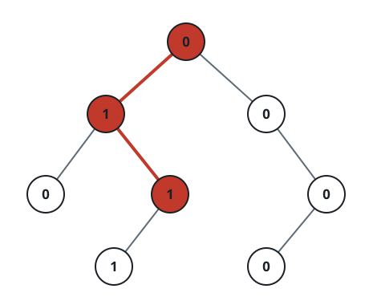

# Check If a String Is a Valid Sequence from Root to Leaves Path in a Binary Tree

## Description

Given a binary tree where each path going from the root to any leaf form
a valid sequence, check if a given string is a valid sequence in such
binary tree.

We get the given string from the concatenation of an array of integers
`arr` and the concatenation of all values of the nodes along a path
results in a sequence in the given binary tree.

A valid sequence must end at a leaf: the path's node values match `arr`
element for element, the path has exactly `arr.length` nodes, and its
last node is a leaf.

### Example 1



```text
Input: root = [0,1,0,0,1,0,null,null,1,0,0], arr = [0,1,0,1]
Output: true
Explanation:
The path 0 -> 1 -> 0 -> 1 is a valid sequence (green color in the
figure).
Other valid sequences are:
0 -> 1 -> 1 -> 0
0 -> 0 -> 0
```

### Example 2



```text
Input: root = [0,1,0,0,1,0,null,null,1,0,0], arr = [0,0,1]
Output: false
Explanation: The path 0 -> 0 -> 1 does not exist, therefore, it is not
even a sequence.
```

### Example 3



```text
Input: root = [0,1,0,0,1,0,null,null,1,0,0], arr = [0,1,1]
Output: false
Explanation: The path 0 -> 1 -> 1 is a sequence, but it is not a valid
sequence.
```

### Constraints

- `1 <= arr.length <= 5000`
- `0 <= arr[i] <= 9`
- Each node's value is between `[0 - 9]`.

## Hints

### Hint 1

Depth-first search (DFS) with the parameters: current node in the binary
tree and current position in the array of integers.

### Hint 2

When reaching at final position check if it is a leaf node.
