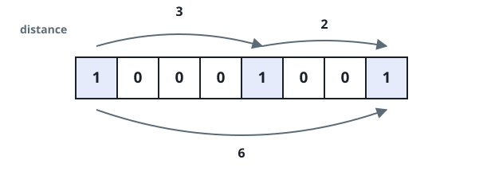
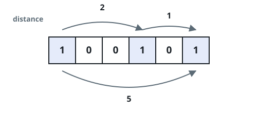

# Check If All 1's Are at Least Length K Places Away

## Description

Given an binary array `nums` and an integer `k`, return `true` if all
`1`'s are at least `k` places away from each other, otherwise return
`false`.

Two `1`'s `k` places away means the number of `0`'s between them is at
least `k`: adjacent indices differ by `k + 1` or more.

### Example 1



```text
Input: nums = [1,0,0,0,1,0,0,1], k = 2
Output: true
Explanation: Each of the 1s are at least 2 places away from each other.
```

### Example 2



```text
Input: nums = [1,0,0,1,0,1], k = 2
Output: false
Explanation: The second 1 and third 1 are only one apart from each other.
```

### Constraints

- `1 <= nums.length <= 10⁵`
- `0 <= k <= nums.length`
- `nums[i]` is `0` or `1`

## Hints

### Hint 1

Each time you find a number 1, check whether or not it is K or more
places away from the next one. If it's not, return false.
