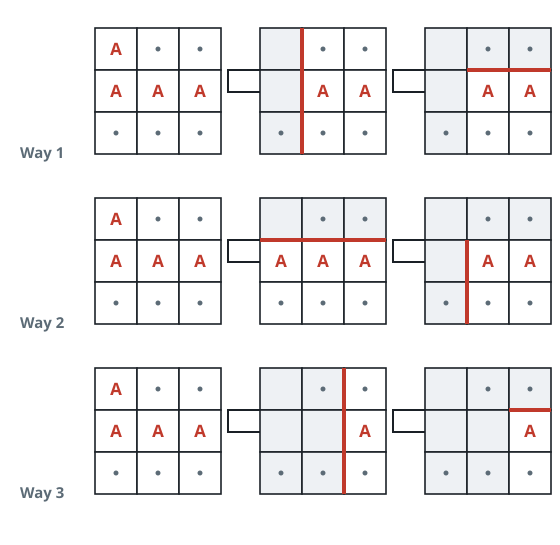

# Number of Ways of Cutting a Pizza

## Description

Given a rectangular pizza represented as a `rows x cols` matrix
containing the following characters: `'A'` (an apple) and `'.'` (empty
cell) and given the integer `k`. You have to cut the pizza into `k`
pieces using `k-1` cuts.

For each cut you choose the direction: vertical or horizontal, then you
choose a cut position at the cell boundary and cut the pizza into two
pieces. If you cut the pizza vertically, give the left part of the pizza
to a person. If you cut the pizza horizontally, give the upper part of
the pizza to a person. Give the last piece of pizza to the last person.

Return the number of ways of cutting the pizza such that each piece
contains at least one apple. Since the answer can be a huge number,
return this modulo `10⁹ + 7`.

### Example 1



```text
Input: pizza = ["A..","AAA","..."], k = 3
Output: 3
Explanation: The figure above shows the three ways to cut the pizza.
Note that pieces must contain at least one apple.
```

### Example 2

```text
Input: pizza = ["A..","AA.","..."], k = 3
Output: 1
```

### Example 3

```text
Input: pizza = ["A..","A..","..."], k = 1
Output: 1
```

### Constraints

- `1 <= rows, cols <= 50`
- `rows == pizza.length`
- `cols == pizza[i].length`
- `1 <= k <= 10`
- `pizza` consists of characters `'A'` and `'.'` only.

## Hints

### Hint 1

Note that after each cut the remaining piece of pizza always has the
lower right coordinate at `(rows-1, cols-1)`.

### Hint 2

Use dynamic programming approach with states `(row1, col1, c)` which
computes the number of ways of cutting the pizza using `c` cuts where
the current piece of pizza has upper left coordinate at `(row1, col1)`
and lower right coordinate at `(rows-1, cols-1)`.

### Hint 3

For the transitions try all vertical and horizontal cuts such that the
piece of pizza you have to give a person must contain at least one
apple. The base case is when `c = k-1`.

### Hint 4

Additionally use a 2D dynamic programming to respond in `O(1)` if a piece
of pizza contains at least one apple.
