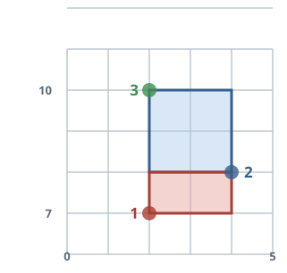

# Rectangles Area

## Description

Table: `Points`

| Column Name | Type |
| ----------- | ---- |
| id          | int  |
| x_value     | int  |
| y_value     | int  |

`id` is the column with unique values for this table. Each point is
represented as a 2D coordinate `(x_value, y_value)`.

Write a solution to report all possible axis-aligned rectangles with a
non-zero area that can be formed by any two points from the `Points`
table.

Each row in the result should contain three columns `(p1, p2, area)`
where:

- `p1` and `p2` are the id's of the two points that determine the
  opposite corners of a rectangle. Each pair is reported once, with
  `p1 < p2`.
- `area` is the area of the rectangle and must be non-zero.

Each testcase's `dataset` seeds the table: its script inserts the
testcase's `Points` rows before your query runs. Return the result table
ordered by `area` in descending order. If there is a tie, order them by
`p1` in ascending order. If there is still a tie, order them by `p2` in
ascending order. The result format is in the following table.

### Example 1



```text
Input:
Points
+----------+-------------+-------------+
| id       | x_value     | y_value     |
+----------+-------------+-------------+
| 1        | 2           | 7           |
| 2        | 4           | 8           |
| 3        | 2           | 10          |
+----------+-------------+-------------+
Output:
+----------+-------------+-------------+
| p1       | p2          | area        |
+----------+-------------+-------------+
| 2        | 3           | 4           |
| 1        | 2           | 2           |
+----------+-------------+-------------+
Explanation:
The rectangle formed by p1 = 2 and p2 = 3 has an area equal to
|4-2| * |8-10| = 4.
The rectangle formed by p1 = 1 and p2 = 2 has an area equal to
|2-4| * |7-8| = 2.
Note that the rectangle formed by p1 = 1 and p2 = 3 is invalid because
the area is 0.
```

Write your solution as a single `SELECT` query returning three columns —
`p1`, `p2` and `area`.

## Hints

### Hint 1

Every unordered pair of points is one candidate rectangle: a self join
with `a.id < b.id` yields each pair exactly once with the smaller id
first.

### Hint 2

The area is `ABS(a.x_value - b.x_value) * ABS(a.y_value - b.y_value)`; a
`WHERE` on both differences being non-zero (or the product being
non-zero) keeps only the non-degenerate rectangles.

### Hint 3

The requested order is a three-key sort: `area` descending, then `p1`
and `p2` ascending.
