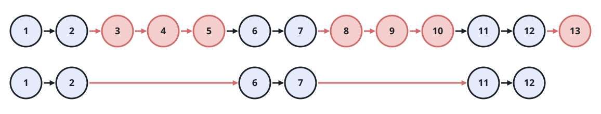

# Delete N Nodes After M Nodes of a Linked List

## Description

The head of a linked list is given, along with two integers `m` and `n`.
Walk the list once, repeating the same two-step rhythm from the current
node until the list runs out:

- keep the next `m` nodes, starting at the current node;
- drop the next `n` nodes.

Return the head of the list that remains once every keep-and-drop cycle
has been applied.

### Example 1



```text
Input: head = [1,2,3,4,5,6,7,8,9,10,11,12,13], m = 2, n = 3
Output: [1,2,6,7,11,12]
Explanation: Nodes 1-2 are kept and 3-5 dropped, then 6-7 are kept and
8-10 dropped, and finally 11-12 are kept; node 13 falls inside the last
drop run.
```

### Example 2


```text
Input: head = [1,2,3,4,5,6,7,8,9,10,11], m = 1, n = 3
Output: [1,5,9]
Explanation: Every cycle keeps a single node and drops the three that
follow it.
```

### Constraints

- The number of nodes in the list is in the range `[1, 10⁴]`.
- `1 <= Node.val <= 10⁶`
- `1 <= m, n <= 1000`

### Follow-up

Could you relink the existing nodes in place instead of building a new
list?

## Hints

### Hint 1

Only the last node of each keep run needs its `next` link rewritten —
stand there and decide what the dropped run leaves behind.

### Hint 2

When a keep or drop run would run past the tail, let it stop early; the
traversal simply ends there.
