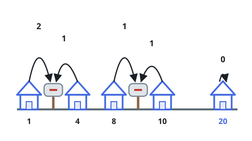
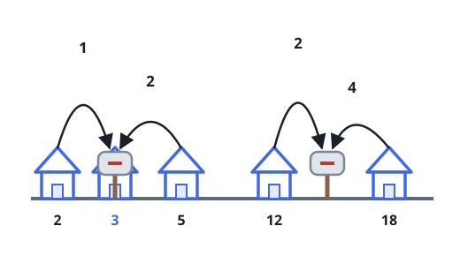

# Allocate Mailboxes

## Description

Given the array `houses` where `houses[i]` is the location of the `i`-th
house along a street, and an integer `k`, allocate `k` mailboxes in the
street.

Return the minimum total distance between each house and its nearest
mailbox.

The test cases are generated so that the answer fits in a 32-bit integer.

### Example 1



```text
Input: houses = [1,4,8,10,20], k = 3
Output: 5
Explanation: Allocate the mailboxes in positions 3, 9 and 20. The minimum
total distance from each house to its nearest mailbox is
|3-1| + |4-3| + |9-8| + |10-9| + |20-20| = 5.
```

### Example 2



```text
Input: houses = [2,3,5,12,18], k = 2
Output: 9
Explanation: Allocate the mailboxes in positions 3 and 14. The minimum
total distance from each house to its nearest mailbox is
|2-3| + |3-3| + |5-3| + |12-14| + |18-14| = 9.
```

### Constraints

- `1 <= k <= houses.length <= 100`
- `1 <= houses[i] <= 10⁴`
- All the integers of `houses` are unique.

## Hints

### Hint 1

If `k = 1`, the minimum distance is obtained by allocating the mailbox at
the median of the array `houses`.

### Hint 2

Generalize this idea with dynamic programming, allocating `k` mailboxes.
