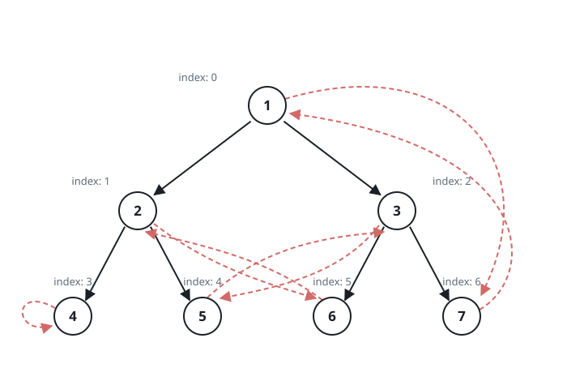

# Clone Binary Tree With Random Pointer

## Description

A binary tree is given such that each node contains an additional random
pointer, which could point to any node in the tree, or null.

Return a deep copy of the tree.

Each node of the tree is shaped like:

```text
class RandomTreeNode {
    public int val;
    public RandomTreeNode left;
    public RandomTreeNode right;
    public RandomTreeNode random;
}
```

The tree is given in its level order, the way an ordinary binary tree is
serialized, except that every present node is a `[val, random_index]` pair
where:

- `val`: an integer representing `RandomTreeNode.val`
- `random_index`: the position, counted in level order over the present
  nodes of the tree (the root is `0`), of the node that the random pointer
  points to, or null if it does not point to any node.

The returned tree is read back in the same `[val, random_index]` form, so
the copy must mirror the input's structure and random pointers exactly —
and every node of the copy must be fresh: none of the returned nodes, the
random targets included, may be a node of the input tree.

### Example 1


```text
Input: root = [[1,null],null,[4,2],[7,0]]
Output: [[1,null],null,[4,2],[7,0]]
Explanation: The original binary tree is [1,null,4,7]: node 4 hangs to the
right of the root and node 7 is node 4's left child. The random pointer of
node 1 is null, so it is represented as [1, null]. The random pointer of
node 4 is node 7, the third node in level order, so it is represented as
[4, 2]. The random pointer of node 7 is the root, so it is represented as
[7, 0].
```

### Example 2


```text
Input: root = [[1,2],null,[1,0],null,[1,3],[1,3]]
Output: [[1,2],null,[1,0],null,[1,3],[1,3]]
Explanation: The random pointer of a node can be the node itself: the last
node in level order points to itself.
```

### Example 3



```text
Input: root = [[1,6],[2,5],[3,4],[4,3],[5,2],[6,1],[7,0]]
Output: [[1,6],[2,5],[3,4],[4,3],[5,2],[6,1],[7,0]]
```

### Constraints

- The number of nodes in the tree is in the range `[0, 1000]`.
- `1 <= RandomTreeNode.val <= 10⁶`
- `RandomTreeNode.random` is null or points to an existing node of the same
  tree.

### Follow up

Can you clone the tree without the extra node map, using constant space
beyond the copy itself?

## Hints

### Hint 1

Traverse the tree and create a copy of every node. A random pointer can
reach a node long before the walk does, so record which copy belongs to
which original as you go — keyed by the node itself, not by its value,
since values repeat freely.

### Hint 2

Fill the map completely before wiring anything: a second pass can then
point each copy's left, right, and random at the map entries of the
original's targets, and every lookup is guaranteed to hit.

### Hint 3

The map only remembers pairings the tree could hold itself: interleave
each clone between its original and that original's left child, read every
random target as `original.random.left`, then split the weave apart.
