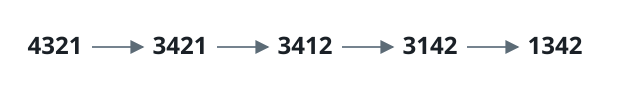

# Minimum Possible Integer After at Most K Adjacent Swaps On Digits

## Description

You are given a string `num` representing the digits of a very large
integer and an integer `k`. You are allowed to swap any two **adjacent**
digits of the integer at most `k` times.

Return the minimum integer you can obtain, also as a string.

### Example 1



```text
Input: num = "4321", k = 4
Output: "1342"
Explanation: Four adjacent swaps bring 1 to the front, then 3 ahead of the
remaining digits, producing "1342" as the smallest reachable arrangement.
```

### Example 2

```text
Input: num = "100", k = 1
Output: "010"
Explanation: It's ok for the output to have leading zeros, but the input is
guaranteed not to have any leading zeros.
```

### Example 3

```text
Input: num = "36789", k = 1000
Output: "36789"
Explanation: We can keep the number without any swaps.
```

### Constraints

- `1 <= num.length <= 3 * 10⁴`
- `num` consists of only digits and does not contain leading zeros.
- `1 <= k <= 10⁹`

## Hints

### Hint 1

We want to make the smaller digits the most significant digits in the
number.

### Hint 2

For each index `i`, check the smallest digit in a window of size `k` and
append it to the answer. Update the indices of all digits in this range
accordingly.
