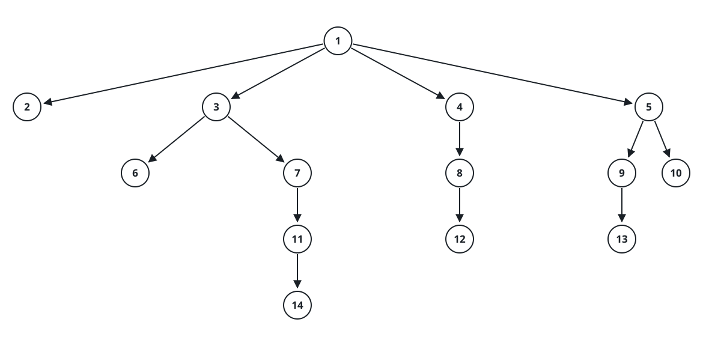
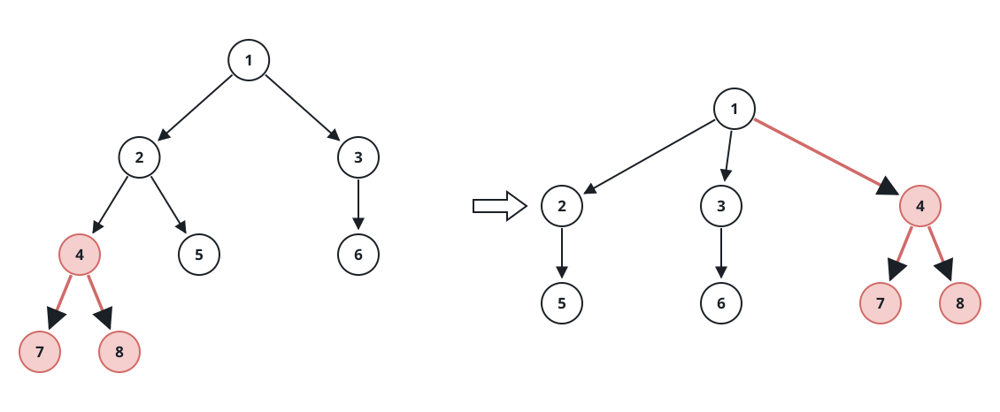
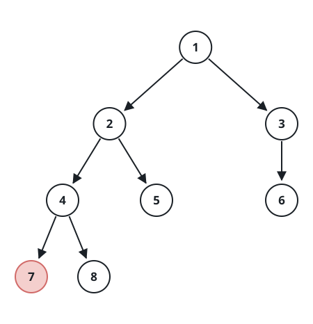

# Move Sub-Tree of N-Ary Tree

## Description

Given the root of an n-ary tree of unique values and two of its nodes, p
and q, move the subtree rooted at p so that it becomes a direct child of
q, and return the root of the tree after the adjustment. If p is already
a direct child of q, leave the tree unchanged. Either way, p must end up
as the last child in the children list of q.

The relative position of the two nodes admits exactly three cases:

- q lies inside the subtree of p;
- p lies inside the subtree of q;
- neither node lies inside the other's subtree.

In the last two cases the move is a plain re-attachment: lift p together
with its whole subtree and hang it under q. In the first case that same
lift would tear the tree apart, because q travels inside p's subtree
while also being the node that must keep the tree connected to the rest —
so q has to be re-attached into the very slot p is lifted from, and when
p is the root itself, q takes over as the new root. Please read the
examples carefully before solving; between them they cover every case.

Nary-Tree input serialization is represented in their level order
traversal, each group of children is separated by the null value (See
examples).



For example, the above tree is serialized as
[1,null,2,3,4,5,null,null,6,7,null,8,null,9,10,null,null,11,null,12,null,13,null,null,14].

### Example 1



```text
Input: root = [1,null,2,3,null,4,5,null,6,null,7,8], p = 4, q = 1
Output: [1,null,2,3,4,null,5,null,6,null,7,8]
Explanation: p lies inside the subtree of q, so the move is a plain
re-attachment: node 4 with its subtree is lifted and hung directly under
node 1. Notice that node 4 becomes the last child of node 1.
```

### Example 2



```text
Input: root = [1,null,2,3,null,4,5,null,6,null,7,8], p = 7, q = 4
Output: [1,null,2,3,null,4,5,null,6,null,7,8]
Explanation: p is already a direct child of q, so nothing changes.
```

### Example 3


```text
Input: root = [1,null,2,3,null,4,5,null,6,null,7,8], p = 3, q = 8
Output: [1,null,2,null,4,5,null,7,8,null,null,null,3,null,6]
Explanation: Neither node lies inside the other's subtree: node 3 with
its subtree is detached from node 1 and re-hung as the last child of
node 8.
```

### Example 4


```text
Input: root = [1,null,2,3,null,4], p = 1, q = 4
Output: [4,null,1,null,2,3]
Explanation: q lies inside the subtree of p: node 4 is disconnected from
its parent, takes over the root slot p is lifted from, and the old root
becomes node 4's last child.
```

### Constraints

- The total number of nodes is in the range `[2, 1000]`.
- Each node has a unique value.
- p and q are two distinct nodes of the tree.

## Hints

### Hint 1

Every case starts the same way: detach p from its parent and append it as
the last child of q.

### Hint 2

When q lies inside p's subtree, detaching p would strand the rest of the
tree. Re-hang q into the slot p is lifted from — the position p held in
its parent's children list, or the root itself when p is the root.

### Hint 3

You only ever need two facts before the rewiring: p's parent, and whether
q sits inside p's subtree. One traversal can carry both.
