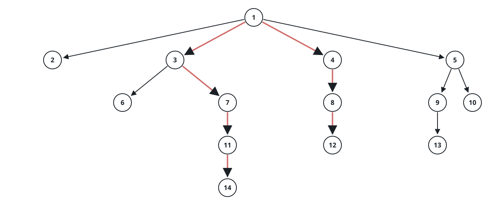

# Diameter of N-ary Tree

## Description

Given the `root` of an n-ary tree, return the length of the tree's
diameter.

The diameter of an n-ary tree is the length of the longest path between
any two nodes in the tree. A path's length is the number of edges between
its two endpoints, and the path may or may not pass through the root.

The n-ary tree input is serialized in level order, where each group of
children is separated by a `null` value (see examples).

### Example 1


```text
Input: root = [1,null,3,2,4,null,5,6]
Output: 3
Explanation: The longest path runs 5 → 3 → 1 → 2 — three edges, bending
through the root between the branch under node 3 and the branch under
node 2.
```

### Example 2


```text
Input: root = [1,null,2,null,3,4,null,5,null,6]
Output: 4
Explanation: The tree hangs off a single chain: 1 → 2, then 2 → 3 and
2 → 4, then 3 → 5 and 4 → 6. The longest path joins the two deepest
leaves, 5 and 6, through their grandparent node 2 — it never touches the
root.
```

### Example 3



```text
Input: root = [1,null,2,3,4,5,null,null,6,7,null,8,null,9,10,null,null,11,null,12,null,13,null,null,14]
Output: 7
Explanation: The longest path runs 14 → 11 → 7 → 3 → 1 → 4 → 8 → 12 —
seven edges from the deepest leaf on the left side of the tree to a
deepest leaf on the right.
```

### Constraints

- The total number of nodes is in the range `[1, 10⁴]`.
- The depth of the n-ary tree is less than or equal to 1000.

## Hints

### Hint 1

Every longest path bends through exactly one node: its two arms run
downward from that node into two of its child subtrees. No longest path
climbs through a node and back down into the same child twice — that
would repeat an edge.

### Hint 2

A post-order walk can hand each node's height — the length, in edges, of
its longest downward arm — back to its parent. Each node then measures
the bend through itself as the sum of its two tallest child heights plus
the two edges that join them, and the answer is the widest bend anywhere
in the tree.
