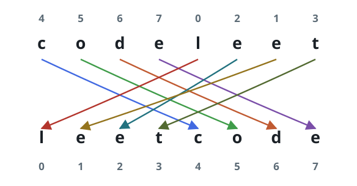

# Shuffle String

## Description

You are given a string `s` and an integer array `indices` of the same
length. The character at position `i` of `s` moves to position
`indices[i]` in the shuffled string.

Return the shuffled string.

### Example 1



```text
Input: s = "codeleet", indices = [4,5,6,7,0,2,1,3]
Output: "leetcode"
Explanation: The character 'c' at position 0 moves to position 4, 'o' at
position 1 moves to position 5, 'd' at position 2 moves to position 6,
'e' at position 3 moves to position 7, 'l' at position 4 moves to
position 0, 'e' at position 5 moves to position 2, 'e' at position 6
moves to position 1, and 't' at position 7 moves to position 3, so
"codeleet" becomes "leetcode".
```

### Example 2

```text
Input: s = "abc", indices = [0,1,2]
Output: "abc"
Explanation: After shuffling, each character remains in its position.
```

### Constraints

- `s.length == indices.length == n`
- `1 <= n <= 100`
- `s` consists of only lowercase English letters.
- `0 <= indices[i] < n`
- All values of `indices` are unique.

## Hints

### Hint 1

You can create an auxiliary string `t` of length `n`.

### Hint 2

Assign `t[indices[i]]` to `s[i]` for each `i` from `0` to `n - 1`.
