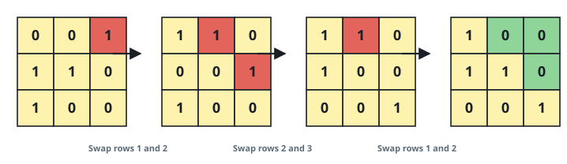
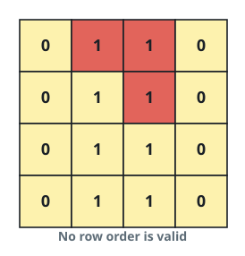
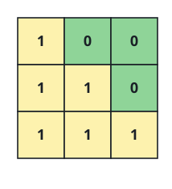

# Minimum Swaps to Arrange a Binary Grid

## Description

You are given an `n x n` binary `grid`. In one step you may choose two
**adjacent** rows of the grid (rows `i` and `i + 1`, for some valid `i`)
and swap them.

The main diagonal of the grid runs from the top-left cell to the
bottom-right cell — cell `(i, i)` for every row `i` (0-indexed). The grid
is **valid** if every cell strictly above the main diagonal is `0`; that
is, for every row `i`, `grid[i][j] == 0` for all `j > i`.

Return the minimum number of adjacent-row swaps needed to make the grid
valid, or `-1` if no sequence of swaps can make it valid.

### Example 1



```text
Input: grid = [[0,0,1],[1,1,0],[1,0,0]]
Output: 3
Explanation: Row 2 (0-indexed) already has two trailing zeros, which is
enough to sit in row 0. Swapping rows 1 and 2, then rows 0 and 1, moves
it there in 2 steps, leaving [[1,0,0],[0,0,1],[1,1,0]]. Row 2 now has one
trailing zero, enough for row 1, and one more adjacent swap moves it up:
[[1,0,0],[1,1,0],[0,0,1]]. That is 3 swaps in total, and no shorter
sequence makes the grid valid.
```

### Example 2



```text
Input: grid = [[0,1,1,0],[0,1,1,0],[0,1,1,0],[0,1,1,0]]
Output: -1
Explanation: All rows are identical, so no swap ever changes the grid,
and it never becomes valid.
```

### Example 3



```text
Input: grid = [[1,0,0],[1,1,0],[1,1,1]]
Output: 0
```

### Constraints

- `n == grid.length == grid[i].length`
- `1 <= n <= 200`
- `grid[i][j]` is `0` or `1`

## Hints

### Hint 1

For each row, count the zeros trailing after its last `1` — this tells
you how far right the row's zeros already reach.

### Hint 2

Row `i` (0-indexed) needs at least `n - i - 1` trailing zeros to sit in
row `i`. Process rows top to bottom and greedily pull up the nearest row
below the current position that has enough trailing zeros, bubbling it up
one adjacent swap at a time.

### Hint 3

If no row at or below the current position has enough trailing zeros,
the grid can never be made valid — return `-1`.
