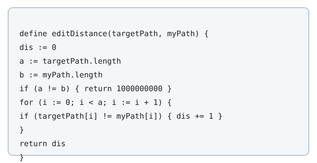

# The Most Similar Path in a Graph

## Description

A road network connects `n` cities, numbered `0` to `n - 1`, by
`roads[i] = [a, b]`, a bidirectional road between city `a` and city `b`.
Every city has a three-letter, upper-case name given by `names`; two
different cities may share the same name. The network is connected: you
can travel between any two cities by some sequence of roads.

You are given a string array `targetPath`. Find a path through the
network — a sequence of cities `ans` with `ans.length ==
targetPath.length`, where every consecutive pair `ans[i]`, `ans[i + 1]`
is joined by a road — whose sequence of city names differs from
`targetPath` at as few positions as possible. Since both sequences have
the same length, "differs" simply counts the positions `i` where
`names[ans[i]] != targetPath[i]`. A city may appear more than once in
`ans`, and consecutive entries may repeat by crossing the same road back
and forth.



Return `ans`. If several paths tie for the fewest differing positions,
return any one of them.

### Example 1


```text
Input: n = 5, roads = [[0,2],[0,3],[1,2],[1,3],[1,4],[2,4]],
       names = ["ATX","SEA","ORD","MIA","BOS"], targetPath = ["ATX","MIA","BOS","ORD"]
Output: [0,3,0,2]
Explanation: [0,3,0,2], [0,3,1,2], and [0,2,4,2] all differ from
targetPath at exactly one position, and no path does better.
[0,3,0,2] spells ["ATX","MIA","ATX","ORD"], which matches targetPath
everywhere except index 2.
```

### Example 2


```text
Input: n = 2, roads = [[0,1]], names = ["ATX","SEA"],
       targetPath = ["AAA","BBB","CCC","DDD","EEE","FFF","GGG","HHH"]
Output: [1,0,1,0,1,0,1,0]
Explanation: No city is ever named any of targetPath's entries, so every
walk through this two-city network differs from targetPath at all 8
positions; every such walk is an accepted answer.
```

### Example 3


```text
Input: n = 6, roads = [[0,1],[1,2],[2,3],[3,4],[4,5]],
       names = ["ATX","SEA","ORD","ATX","MIA","BOS"],
       targetPath = ["ATX","MIA","BOS","MIA","ATX","ORD","SEA"]
Output: [3,4,5,4,3,2,1]
Explanation: [3,4,5,4,3,2,1] spells targetPath exactly, with zero
differing positions, and is the only path that does.
```

### Constraints

- `2 <= n <= 100`
- `m == roads.length`
- `n - 1 <= m <= n * (n - 1) / 2`
- `0 <= roads[i][0], roads[i][1] <= n - 1`
- `roads[i][0] != roads[i][1]`
- The network is connected, and at most one road joins any pair of
  cities.
- `names.length == n`
- Every entry of `names` has length `3` and consists of upper-case
  English letters.
- `1 <= targetPath.length <= 100`
- Every entry of `targetPath` has length `3` and consists of upper-case
  English letters.

### Follow up

If a city may be visited at most once, what changes in your approach?

## Hints

### Hint 1

Let `dp[i][c]` be the fewest differing positions among paths of length
`i + 1` that end at city `c`. Build it up one position of `targetPath`
at a time.

### Hint 2

`dp[i][c]` only needs the previous row: it is the smallest `dp[i -
1][u]` over roads `u - c`, plus `1` if `names[c] != targetPath[i]`.

### Hint 3

Once the last row of `dp` is filled, walk it backward from whichever
city minimizes it to recover one path achieving that minimum.
