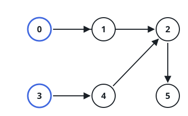
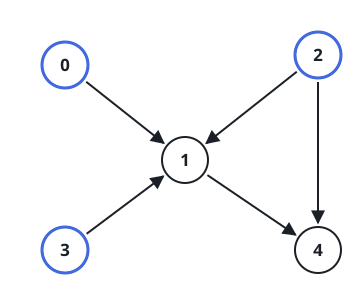

# Minimum Number of Vertices to Reach All Nodes

## Description

You are given a directed acyclic graph with `n` vertices numbered from `0`
to `n - 1`, and an array `edges` where `edges[i] = [fromi, toi]` represents a
directed edge from node `fromi` to node `toi`.

Find the smallest set of vertices from which every node in the graph is
reachable. It is guaranteed that a unique solution exists.

You can return the vertices in any order.

### Example 1



```text
Input: n = 6, edges = [[0,1],[0,2],[2,5],[3,4],[4,2]]
Output: [0,3]
Explanation: It is not possible to reach all the nodes from a single
vertex. From 0 we can reach [0,1,2,5]. From 3 we can reach [3,4,2,5]. So we
output [0,3].
```

### Example 2



```text
Input: n = 5, edges = [[0,1],[2,1],[3,1],[1,4],[2,4]]
Output: [0,2,3]
Explanation: Vertices 0, 2, and 3 are not reachable from any other node, so
they must be included. Also, any of these vertices can reach nodes 1 and 4.
```

### Constraints

- `2 <= n <= 10^5`
- `1 <= edges.length <= min(10^5, n * (n - 1) / 2)`
- `edges[i].length == 2`
- `0 <= fromi, toi < n`
- All pairs `(fromi, toi)` are distinct.

## Hints

### Hint 1

A node that has no incoming edge can only be reached by itself.

### Hint 2

Any other node with incoming edges can be reached from some other node.

### Hint 3

We only have to count the nodes with zero incoming edges.
