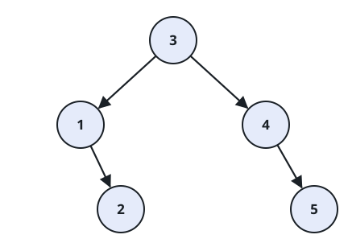

# Number of Ways to Reorder Array to Get Same BST

## Description

You are given `nums`, a permutation of the integers from `1` to `n`.
Build a binary search tree (BST) by inserting the values of `nums` into
an initially empty tree, one at a time, in the order they appear.

Count the number of ways to reorder `nums` into a different sequence
that builds the exact same BST shape when inserted the same way, and
return that count modulo `10^9 + 7`. The original order of `nums`
itself is not counted — only the _other_ orderings that reproduce the
same tree.

### Example 1


```text
Input: nums = [2,1,3]
Output: 1
Explanation: Inserting [2,1,3] puts 2 at the root, 1 as its left child,
and 3 as its right child. Reordering to [2,3,1] builds the identical
tree (insert 3 before 1 still sends 3 right and 1 left of the root).
No other reordering matches, so there is exactly 1 other way.
```

### Example 2



```text
Input: nums = [3,4,5,1,2]
Output: 5
Explanation: The following 5 reorderings all build the same BST as
[3,4,5,1,2]:
[3,1,2,4,5]
[3,1,4,2,5]
[3,1,4,5,2]
[3,4,1,2,5]
[3,4,1,5,2]
```

### Example 3


```text
Input: nums = [1,2,3]
Output: 0
Explanation: Every value is greater than the one before it, so each
insertion becomes a new rightmost node — the tree is a single
right-leaning chain. Any reordering that builds this same chain must
still insert 1 before 2 before 3, which is only the original order, so
there are no other ways.
```

### Constraints

- `1 <= nums.length <= 1000`
- `1 <= nums[i] <= nums.length`
- All integers in `nums` are distinct.

## Hints

### Hint 1

Use a divide-and-conquer strategy: the tree built from a sequence is
completely determined by its first element (the root) and the two
sub-sequences of values that are respectively smaller and larger than
it, in their original relative order.

### Hint 2

The first number of any sequence is always its root. Solve the
smaller-values sub-sequence and the larger-values sub-sequence
independently, then ask: given `x` elements that must keep their
relative order and `y` elements that must keep theirs, in how many ways
can the two groups be merged (interleaved) into one sequence of length
`x + y`?
