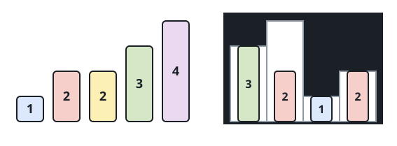
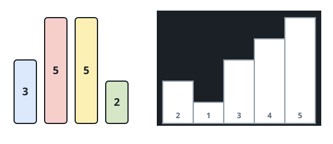
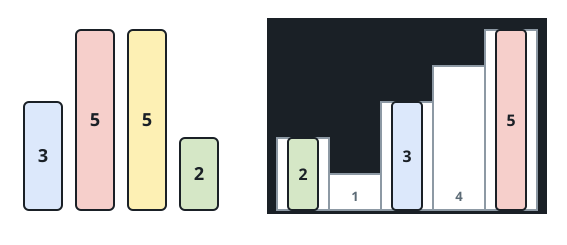

# Put Boxes Into the Warehouse II

## Description

You are given two arrays of positive integers, `boxes` and `warehouse`,
representing the heights of some boxes of unit width and the heights of
`n` rooms in a warehouse. The warehouse's rooms are labeled `0` to
`n - 1` from left to right, where `warehouse[i]` (0-indexed) is the
height of the `i`th room.

Boxes are put into the warehouse under the following rules:

- Boxes cannot be stacked.
- You may rearrange the insertion order of the boxes.
- Boxes can be pushed into the warehouse from **either side** — left or
  right.
- If the height of some room in the warehouse is less than the height of
  a box, then that box, and every other box still behind it in that
  push, is stopped before that room — it and the boxes behind it can
  never reach a room past that point, no matter how tall that later room
  is.

Return the maximum number of boxes you can put into the warehouse.

### Example 1




```text
Input: boxes = [1,2,2,3,4], warehouse = [3,4,1,2]
Output: 4
Explanation: The height-4 box never fits, since no room is reachable at
height 4 from either side. The other four boxes all fit: the height-1
box settles into room 2 from either side, a height-2 box enters room 3
from the right, the other height-2 box enters room 1 from the left, and
the height-3 box enters room 0 from the left. Other orderings that also
place 4 boxes exist — for example, swapping which height-2 box goes
where.
```

### Example 2





```text
Input: boxes = [3,5,5,2], warehouse = [2,1,3,4,5]
Output: 3
Explanation: Room 4 (height 5) is the only room ever reachable at height
5 — it is the first room met coming from the right, so nothing shorter
than it stands in the way. Since that is the sole room offering height
5, only one of the two height-5 boxes can ever be placed; the other must
be left out. The height-2 and height-3 boxes both fit elsewhere, for 3
boxes placed in total.
```

### Constraints

- `n == warehouse.length`
- `1 <= boxes.length, warehouse.length <= 10⁵`
- `1 <= boxes[i], warehouse[i] <= 10⁹`

## Hints

### Hint 1

Try to put at least one box in the house, pushing it from either side.

### Hint 2

Once you have put one box in the house, you can solve the rest with the
same logic used for version I: treat it as a warehouse open only from
the left, and a warehouse open only from the right, combined.
