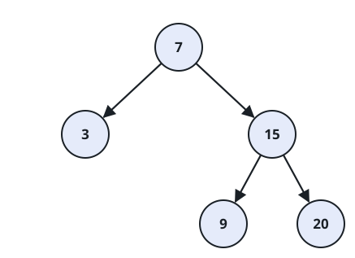

# Binary Search Tree Iterator II

## Description

You are given the root of a binary search tree. Build an iterator that
walks its values in ascending order but can also step backward: at any
point it can hand out the next larger value or retreat to a smaller
value it has already visited.

Implement the `BSTIterator` class:

- `BSTIterator(TreeNode root)` — create the iterator over the tree
  rooted at `root`. The pointer starts at a non-existent position
  smaller than every value in the tree, so nothing has been handed out
  yet and there is nothing to step back to.
- `boolean hasNext()` — return `true` if a value lies to the right of
  the pointer (a larger value not yet reached).
- `int next()` — move the pointer one step right and return the value
  there.
- `boolean hasPrev()` — return `true` if a value lies to the left of the
  pointer (a smaller value already visited).
- `int prev()` — move the pointer one step left and return the value
  there.

`next()` is only called while `hasNext()` would return `true`, and
`prev()` only while `hasPrev()` would return `true`.

The tree reaches your constructor already assembled from its nodes. In
the examples a tree is written as its level-order listing, where `null`
stands for an absent child; children of absent nodes are skipped and
trailing `null`s are dropped.

### Example 1



```text
Input:
["BSTIterator", "next", "next", "prev", "next", "hasNext", "next", "next", "next", "hasNext", "hasPrev", "prev", "prev"]
[[[7, 3, 15, null, null, 9, 20]], [], [], [], [], [], [], [], [], [], [], [], []]
Output: [null, 3, 7, 3, 7, true, 9, 15, 20, false, true, 15, 9]
Explanation:
The tree is
      7
     / \
    3   15
       /  \
      9    20
and its in-order values are 3, 7, 9, 15, 20. The pointer starts before 3;
next() advances it forward through 3 and 7, prev() steps it back to 3,
next() replays 7, and the walk then continues forward through 9, 15, 20
until hasNext() reports nothing remains, after which prev() walks back
down to 9.
```

### Example 2

```text
Input:
["BSTIterator", "hasPrev", "next", "hasPrev", "next", "hasPrev", "prev"]
[[[2, 1, 3]], [], [], [], [], [], []]
Output: [null, false, 1, false, 2, true, 1]
Explanation:
The tree is
    2
   / \
  1   3
with in-order values 1, 2, 3. Immediately after construction hasPrev()
is false — no value has been handed out yet, so there is nothing to step
back to. Each next() extends the visited history by one, and hasPrev()
only turns true once a second value has been handed out.
```

### Constraints

- The number of nodes in the tree is in the range `[1, 10⁵]`.
- `0 <= Node.val <= 10⁶`
- At most `10⁵` calls in total are made to `hasNext`, `next`, `hasPrev`,
  and `prev`.

### Follow up

Could you support `next()` and `prev()` in `O(1)` time using `O(h)`
memory instead of precalculating the entire in-order traversal, `h`
being the tree's height?
