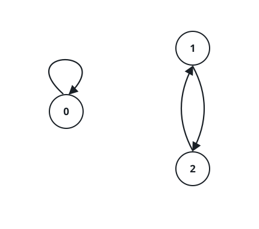

# Maximum Number of Achievable Transfer Requests

## Description

There are `n` buildings, numbered from `0` to `n - 1`, each currently full of
employees. It is transfer season, and some employees want to move to a
different building.

You are given an array `requests`, where `requests[i] = [from_i, to_i]`
represents an employee's request to transfer from building `from_i` to
building `to_i`.

Since every building starts full, a set of requests can only be carried out
together if, for every building, the number of employees leaving equals the
number of employees arriving — the net change is zero for each building. For
example, if two employees leave building `0`, one leaves building `1`, and
one leaves building `2`, then exactly two employees must arrive at building
`0`, one at building `1`, and one at building `2`.

Return the maximum number of requests that can be achieved together.

### Example 1


```text
Input: n = 5, requests = [[0,1],[1,0],[0,1],[1,2],[2,0],[3,4]]
Output: 5
Explanation: One achievable set drops only request [3,4]:
- Building 0 loses 2 (both [0,1] requests) and gains 1 (from [1,0]) plus 1 (from [2,0]) = 2.
- Building 1 loses 1 (from [1,0]) and gains 2 (from the two [0,1] requests), then loses 1 more (from [1,2]) — net loses 2, gains 2.
- Building 2 loses 1 (from [2,0]) and gains 1 (from [1,2]).
Every building's arrivals equal its departures, so all 5 of these requests are simultaneously achievable.
```

### Example 2



```text
Input: n = 3, requests = [[0,0],[1,2],[2,1]]
Output: 3
Explanation: The employee behind [0,0] requests to stay in building 0, which
trivially balances. The employees behind [1,2] and [2,1] swap places. All
three requests are achievable together.
```

### Example 3

```text
Input: n = 4, requests = [[0,3],[3,1],[1,2],[2,0]]
Output: 4
Explanation: The requests form a single cycle 0 -> 3 -> 1 -> 2 -> 0, so every
building loses exactly one employee and gains exactly one employee.
```

### Constraints

- `1 <= n <= 20`
- `1 <= requests.length <= 16`
- `requests[i].length == 2`
- `0 <= from_i, to_i < n`

## Hints

### Hint 1

Think brute force.

### Hint 2

When is a subset of requests okay?
