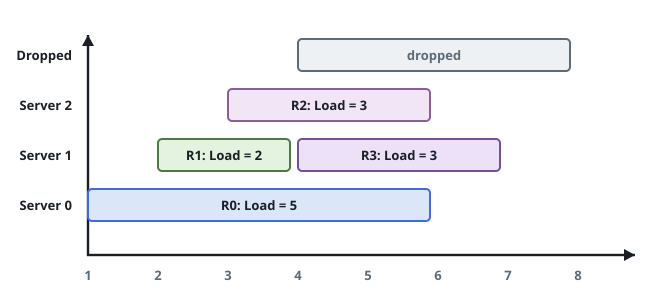

# Find Servers That Handled Most Number of Requests

## Description

There are `k` servers, numbered `0` to `k - 1`, load-balancing an incoming
stream of requests. Every server can run only one request at a time, but
otherwise has unlimited computing power.

Requests arrive one at a time, in order, and are routed by a fixed rule.
For the `i`-th request (`0`-indexed):

- If every server is currently busy, the request is **dropped** — it is
  never handled by anyone.
- Otherwise, the router first tries server `i % k`. If that server is
  free, the request goes there.
- If server `i % k` is busy, the router tries `(i % k) + 1`, then
  `(i % k) + 2`, and so on, wrapping back to server `0` after server
  `k - 1`, until it reaches a free server — which is guaranteed to exist
  whenever not every server is busy.

You are given `arrival`, a strictly increasing array of positive
integers where `arrival[i]` is the time the `i`-th request shows up, and
`load`, where `load[i]` is how long that request occupies whichever
server handles it (so a server that starts request `i` at `arrival[i]`
is busy through `arrival[i] + load[i]`, and free again from that instant
on).

Find the server(s) that end up handling the largest number of requests.
Return their ids as a list, in any order; if several servers are tied
for the most requests handled, return all of them.

### Example 1



```text
Input: k = 3, arrival = [1,2,3,4,5], load = [5,2,3,3,3]
Output: [1]
Explanation:
All servers start out free.
Requests 0, 1, and 2 land on servers 0, 1, and 2 in order.
Request 3 arrives at time 4: server 0 is still busy until time 6, so the
request wraps forward and is handled by server 1.
Request 4 arrives at time 5: every server is busy (0 until 6, 1 until 7,
2 until 6), so it is dropped.
Servers 0 and 2 each handled one request; server 1 handled two. Server 1
is the busiest.
```

### Example 2

```text
Input: k = 3, arrival = [1,2,3,4], load = [1,2,1,2]
Output: [0]
Explanation:
Requests 0, 1, and 2 land on servers 0, 1, and 2 in order.
Request 3 arrives at time 4: server 0 finished at time 2 and is free
again, so it is handled by server 0.
Server 0 handled two requests; servers 1 and 2 handled one each. Server 0
is the busiest.
```

### Example 3

```text
Input: k = 3, arrival = [1,2,3], load = [10,12,11]
Output: [0,1,2]
Explanation: Each of the three requests lands on its own server, and
none finishes before the next one arrives, so every server handles
exactly one request. All three are tied for busiest.
```

### Constraints

- `1 <= k <= 10⁵`
- `1 <= arrival.length, load.length <= 10⁵`
- `arrival.length == load.length`
- `1 <= arrival[i], load[i] <= 10⁹`
- `arrival` is strictly increasing.

## Hints

### Hint 1

Keep the currently-free server ids in a structure that can quickly answer
"what is the smallest free id that is `>= x`", so the wraparound search
does not have to walk servers one at a time.

### Hint 2

Keep the busy servers in a min-heap ordered by finish time. Before
routing each new request, pop every server whose finish time is `<=` the
new request's arrival time and mark it free again.
