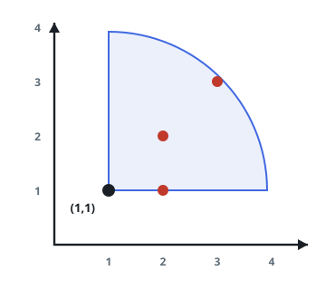
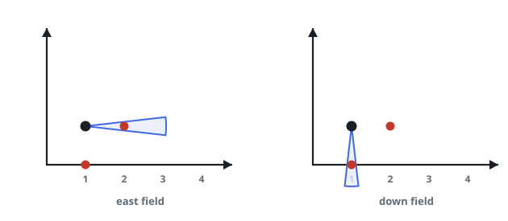

# Maximum Number of Visible Points

## Description

You are given an array `points`, an integer `angle`, and your `location`,
where `location = [posx, posy]` and `points[i] = [xi, yi]` both denote
integral coordinates on the X-Y plane.

Initially, you are facing directly east from your position. You cannot
move from your position, but you can rotate. In other words, `posx` and
`posy` cannot be changed. Your field of view in degrees is represented by
`angle`, determining how wide you can see from any given view direction.
Let `d` be the amount in degrees that you rotate counterclockwise. Then,
your field of view is the inclusive range of angles `[d - angle / 2,
d + angle / 2]`.

You can see some set of points if, for each point, the angle formed by the
point, your position, and the immediate east direction from your position
is in your field of view.

There can be multiple points at one coordinate. There may be points at
your location, and you can always see these points regardless of your
rotation. Points do not obstruct your vision to other points.

Return the maximum number of points you can see.

### Example 1



```text
Input: points = [[2,1],[2,2],[3,3]], angle = 90, location = [1,1]
Output: 3
Explanation: All three points can be brought into a single 90-degree field
of view, including [3,3] even though [2,2] lies in front of it along the
same line of sight.
```

### Example 2

```text
Input: points = [[2,1],[2,2],[3,4],[1,1]], angle = 90, location = [1,1]
Output: 4
Explanation: All four points can be made visible in a single field of
view, including the one at your location.
```

### Example 3



```text
Input: points = [[1,0],[2,1]], angle = 13, location = [1,1]
Output: 1
Explanation: You can only see one of the two points at a time; the two
points are more than 13 degrees apart as seen from your location.
```

### Constraints

- `1 <= points.length <= 10⁵`
- `points[i].length == 2`
- `location.length == 2`
- `0 <= angle < 360`
- `0 <= posx, posy, xi, yi <= 100`

## Hints

### Hint 1

Sort the points by polar angle around your location. Once sorted, only a
consecutive run of the sorted angles can ever be visible at once from a
single field of view.

### Hint 2

Use two pointers (a sliding window) over the sorted angles to track, for
each starting point, how many consecutive angles fit within `angle`
degrees of it.

### Hint 3

To handle the wraparound at 0/360 degrees, append the sorted angle list
to itself with 360 added to each appended value, then slide the window
over the doubled list.
