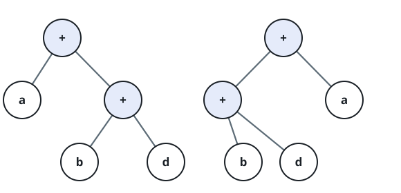

# Check If Two Expression Trees are Equivalent

## Description

A binary expression tree is a kind of binary tree used to represent
arithmetic expressions. Each node has either zero or two children. Leaf
nodes (zero children) correspond to operands (variables), and internal
nodes (two children) correspond to operators. In this problem the only
operator is `+` (addition).

You are given the roots of two binary expression trees, `root1` and
`root2`. Return `true` if the two binary expression trees are equivalent.
Otherwise, return `false`.

Two binary expression trees are equivalent if they evaluate to the same
value regardless of what the variables are set to.

This judge's `TreeNode` carries an integer value, so a node's original
symbol is encoded as one:

- A leaf's variable, a lowercase English letter `'a'`-`'z'`, is encoded as
  its zero-based alphabet position: `ord(letter) - ord('a')`, an integer
  in `[0, 25]`. So `'a'` is `0`, `'b'` is `1`, ..., `'z'` is `25`.
- The `+` operator is encoded as `-1`, a sentinel outside the `[0, 25]`
  leaf range so operator nodes are never mistaken for leaves.

### Example 1

```text
Input: root1 = [23], root2 = [23]
Output: true
```

### Example 2


```text
Input: root1 = [-1,0,-1,null,null,1,2], root2 = [-1,-1,0,1,2]
Output: true
Explanation: Decoded, root1 is a + (b + c) and root2 is (b + c) + a; both
evaluate to the same sum for every assignment of a, b, c.
```

### Example 3



```text
Input: root1 = [-1,0,-1,null,null,1,2], root2 = [-1,-1,0,1,3]
Output: false
Explanation: Decoded, root1 is a + (b + c) and root2 is (b + d) + a; the
variable multisets {a, b, c} and {a, b, d} differ, so the two expressions
disagree whenever c != d.
```

### Constraints

- The number of nodes in both trees is equal, odd, and in the range
  `[1, 4999]`.
- Every node's encoded value is `-1` (an operator) or an integer in
  `[0, 25]` (a leaf variable).
- Both given trees are guaranteed to be valid binary expression trees:
  every node has exactly 0 or exactly 2 children, `-1`-valued nodes always
  have 2 children, and `[0, 25]`-valued nodes always have 0 children.

### Follow up

What would change in your solution if the tree also supported the `-`
operator (subtraction), in addition to `+`?
