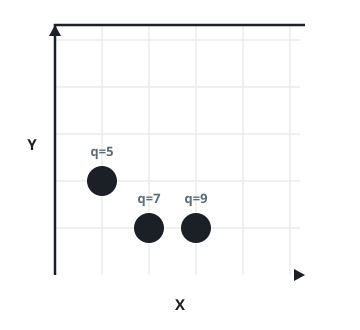

# Coordinate With Maximum Network Quality

## Description

You are given an array of network towers `towers`, where
`towers[i] = [xi, yi, qi]` describes the `i`-th tower at integer location
`(xi, yi)` with quality factor `qi`. Distance between two coordinates is
the Euclidean distance.

You are also given an integer `radius`. A tower is reachable from a
coordinate if the distance between them is less than or equal to
`radius`; beyond that distance the signal is garbled and the tower
contributes nothing.

The signal quality contributed by the `i`-th tower at a coordinate
`(x, y)` is `⌊qi / (1 + d)⌋`, where `d` is the distance between the
tower and `(x, y)` and `⌊val⌋` is the floor function (the greatest
integer less than or equal to `val`). This contribution only counts
when the tower is reachable, i.e. `d <= radius`. The network quality
at a coordinate is the sum of the signal qualities contributed by
every reachable tower.

Return the integer coordinate `[cx, cy]` at which the network quality
is maximum. If several coordinates tie for the maximum, return the
lexicographically smallest coordinate with non-negative components: a
coordinate `(x1, y1)` is smaller than `(x2, y2)` when `x1 < x2`, or
when `x1 == x2` and `y1 < y2`.

### Example 1



```text
Input: towers = [[1,2,5],[2,1,7],[3,1,9]], radius = 2
Output: [2,1]
Explanation: At coordinate (2, 1) the total quality is 13.
- Tower (2, 1), quality 7: distance 0, so ⌊7 / (1 + 0)⌋ = 7.
- Tower (1, 2), quality 5: distance sqrt(2), so ⌊5 / (1 + sqrt(2))⌋ = ⌊2.07...⌋ = 2.
- Tower (3, 1), quality 9: distance 1, so ⌊9 / (1 + 1)⌋ = ⌊4.5⌋ = 4.
No other coordinate reaches a higher total.
```

### Example 2

```text
Input: towers = [[23,11,21]], radius = 9
Output: [23,11]
Explanation: With only one tower, the best quality is right at that tower's
own location, where the distance is 0.
```

### Example 3

```text
Input: towers = [[1,2,13],[2,1,7],[0,1,9]], radius = 2
Output: [1,2]
Explanation: Coordinate (1, 2) has the highest total network quality.
```

### Constraints

- `1 <= towers.length <= 50`
- `towers[i].length == 3`
- `0 <= xi, yi, qi <= 50`
- `1 <= radius <= 50`

## Hints

### Hint 1

The coordinate bounds are small enough to try every possible integer
coordinate directly and compute its total quality.
