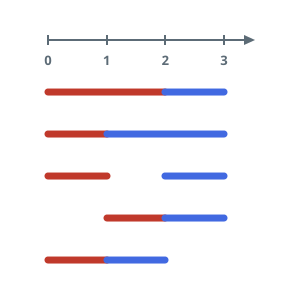

# Number of Sets of K Non-Overlapping Line Segments

## Description

There are `n` points on a 1-D number line, where the `i`-th point (for
`0 <= i < n`) sits at `x = i`. You want to draw exactly `k` line segments,
where each segment connects two of these points and its endpoints must have
integer coordinates (so a segment always covers two or more of the `n`
points).

Two segments are **non-overlapping** if their interiors — the open interval
strictly between their two endpoints — share no point. Segments are allowed
to touch at a shared endpoint; that is not considered overlapping. The `k`
segments do not need to cover all `n` points.

Return the number of distinct sets of `k` non-overlapping segments you can
draw. Since this number can be huge, return it modulo `10⁹ + 7`.

### Example 1



```text
Input: n = 4, k = 2
Output: 5
Explanation: Writing each segment as (left, right), the 5 sets are
{(0,2),(2,3)}, {(0,1),(1,3)}, {(0,1),(2,3)}, {(1,2),(2,3)}, {(0,1),(1,2)}.
The first, second, and fifth sets each pair two segments that share an
endpoint, which is allowed.
```

### Example 2

```text
Input: n = 3, k = 1
Output: 3
Explanation: The 3 sets are {(0,1)}, {(0,2)}, {(1,2)}.
```

### Example 3

```text
Input: n = 30, k = 7
Output: 796297179
Explanation: The true count of sets is 3796297200; taken modulo 10⁹ + 7 it
is 796297179.
```

### Constraints

- `2 <= n <= 1000`
- `1 <= k <= n - 1`

## Hints

### Hint 1

Dynamic programming works here: the current point index together with how
many segments still need to be placed describes any intermediate state.

### Hint 2

To evaluate each state in constant time, add a third flag to the state
recording whether you are in the middle of a segment (its start point has
been placed but not its end point).
