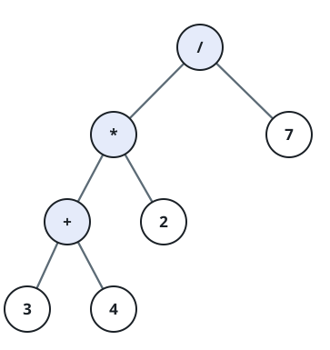
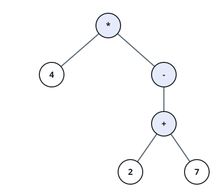

# Design an Expression Tree With Evaluate Function

## Description

A binary expression tree represents an arithmetic expression: every leaf
holds a non-negative integer operand, and every internal node holds one
of the operators `+`, `-`, `*`, `/` and has exactly two children — its
left subtree is the operator's left operand, its right subtree the right
operand.

You are given `postfix`, the postfix (Reverse Polish) tokens of such an
expression: operands appear before the operator that combines them, so
`4*(5-(7+2))` is written as `["4","5","7","2","+","-","*"]`. Evaluate the
expression the tokens describe and return its integer value.

Adapted return contract: the original problem is a class-design exercise
— it asks you to define a `Node` interface with an `evaluate()` method,
implement it with leaf and operator subclasses, and have a
`TreeBuilder.buildTree(postfix)` construct such a tree from the tokens, so
that calling `.evaluate()` on the result produces the answer. This judge's
typed-value invocation vocabulary has no way to accept or check a
hand-designed class hierarchy as a return value, only plain values, so
`buildAndEvaluate` instead returns the single integer that building and
evaluating that tree would produce directly: process `postfix` with a
standard operand stack (push each operand; on an operator, pop the top
two operands, apply the operator, and push the result back), and report
the one value left on the stack once every token has been consumed.
Building an explicit tree of `Node` objects is an implementation detail,
not part of the contract — any method that respects the same evaluation
order is acceptable.

### Example 1



```text
Input: postfix = ["3","4","+","2","*","7","/"]
Output: 2
Explanation: This is the expression ((3+4)*2)/7 = 14/7 = 2.
```

### Example 2



```text
Input: postfix = ["4","5","2","7","+","-","*"]
Output: -16
Explanation: This is the expression 4*(5-(2+7)) = 4*(-4) = -16.
```

### Example 3

```text
Input: postfix = ["4","9","-","2","/"]
Output: -2
Explanation: This is the expression (4-9)/2 = -5/2. Division truncates
toward zero, so -5/2 is -2, not the floor value -3.
```

### Constraints

- `1 <= postfix.length < 100`
- `postfix.length` is odd.
- Each element of `postfix` is either one of the operators `+`, `-`,
  `*`, `/`, or the decimal string form of a non-negative integer operand.
- If `postfix[i]` is an operand, its integer value is no more than
  `10^5`.
- `postfix` is guaranteed to represent a valid, well-formed postfix
  expression: evaluating it left to right with a single operand stack
  never underflows the stack, and exactly one value remains once every
  token has been processed.
- Division truncates toward zero.
- `postfix` is guaranteed never to divide by zero.
- The absolute value of the final result, and of every intermediate
  value produced while evaluating `postfix`, will not exceed `10^9`.

## Hints

### Hint 1

Process the tokens left to right with a single operand stack: push each
operand you see, and whenever you see an operator, pop the top two
operands, apply the operator to them, and push the result back.

### Hint 2

The one value left on the stack once every token is consumed is the
answer — it is exactly what evaluating the expression tree bottom-up
would produce, without needing to materialize any tree nodes.
