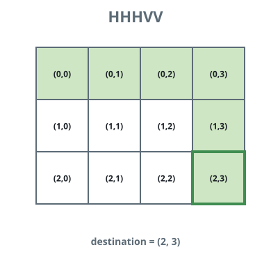
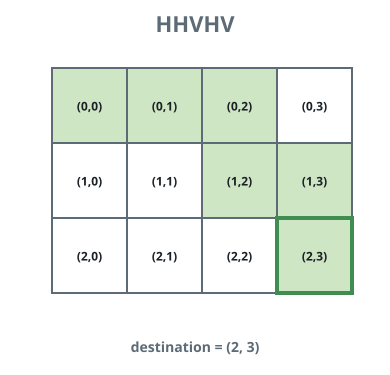

# Kth Smallest Instructions

## Description

Bob starts at cell `(0, 0)` on a grid and wants to reach the cell
`destination = [row, column]`. He may only move right or down, one cell at
a time. An instruction string encodes his path: each character is either

- `'H'`, meaning move horizontally (one cell right), or
- `'V'`, meaning move vertically (one cell down).

Any instruction string that contains exactly `column` `'H'` characters and
exactly `row` `'V'` characters, in some order, is a valid path from `(0,
0)` to `destination`. For example, if `destination = [2, 3]`, both
`"HHHVV"` and `"HVHVH"` are valid.

Among all valid instruction strings, ranked in lexicographic order
(`'H'` sorts before `'V'`), return the `k`-th smallest one. `k` is
1-indexed.

### Example 1



```text
Input: destination = [2, 3], k = 1
Output: "HHHVV"
Explanation: All the instructions that reach (2, 3), in lexicographic
order, are:
["HHHVV", "HHVHV", "HHVVH", "HVHHV", "HVHVH", "HVVHH", "VHHHV", "VHHVH",
"VHVHH", "VVHHH"]. The 1st smallest is "HHHVV".
```

### Example 2



```text
Input: destination = [2, 3], k = 2
Output: "HHVHV"
Explanation: Using the same ordering as Example 1, the 2nd smallest
instruction string is "HHVHV".
```

### Example 3


```text
Input: destination = [2, 3], k = 3
Output: "HHVVH"
Explanation: Using the same ordering as Example 1, the 3rd smallest
instruction string is "HHVVH".
```

### Constraints

- `destination.length == 2`
- `1 <= row, column <= 15`
- `1 <= k <= nCr(row + column, row)`, where `nCr(a, b)` denotes
  `a choose b`.

## Hints

### Hint 1

There are `nCr(row + column, row)` possible instruction strings that
reach `(row, column)`.

### Hint 2

Build the instruction string one character at a time. At each step, count
how many valid completions start with `'H'`, and compare that count with
the remaining `k`.
