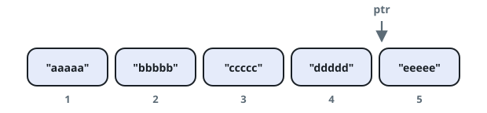

# Design an Ordered Stream

## Description

A stream of `n` `(idKey, value)` pairs arrives in arbitrary order, where
`idKey` is an integer between `1` and `n` and `value` is a string. No two
pairs share the same id.

Design a stream that produces the values in increasing order of their ids
by returning a chunk (list) of values after each insertion. Concatenating
all the chunks, in the order they were returned, must yield the list of
values sorted by id.

Implement the `OrderedStream` class:

- `OrderedStream(int n)` constructs the stream to accept `n` values.
- `String[] insert(int idKey, String value)` inserts the pair
  `(idKey, value)` into the stream, then returns the largest possible
  chunk of currently inserted values that appear next in the order.

### Example 1

```text
Input:
["OrderedStream", "insert", "insert", "insert", "insert", "insert"]
[[5], [3, "ccccc"], [1, "aaaaa"], [2, "bbbbb"], [5, "eeeee"], [4, "ddddd"]]
Output: [null, [], ["aaaaa"], ["bbbbb", "ccccc"], [], ["ddddd", "eeeee"]]
Explanation:
Note that the values ordered by id are ["aaaaa", "bbbbb", "ccccc",
"ddddd", "eeeee"].
OrderedStream os = new OrderedStream(5);
os.insert(3, "ccccc"); // inserts (3, "ccccc"), returns []
os.insert(1, "aaaaa"); // inserts (1, "aaaaa"), returns ["aaaaa"]
os.insert(2, "bbbbb"); // inserts (2, "bbbbb"), returns ["bbbbb", "ccccc"]
os.insert(5, "eeeee"); // inserts (5, "eeeee"), returns []
os.insert(4, "ddddd"); // inserts (4, "ddddd"), returns ["ddddd", "eeeee"]
Concatenating all the chunks returned:
[] + ["aaaaa"] + ["bbbbb", "ccccc"] + [] + ["ddddd", "eeeee"]
= ["aaaaa", "bbbbb", "ccccc", "ddddd", "eeeee"]
The resulting order is the same as the order above.
```



### Constraints

- `1 <= n <= 1000`
- `1 <= id <= n`
- `value.length == 5`
- `value` consists only of lowercase English letters.
- Each call to `insert` will have a unique id.
- Exactly `n` calls will be made to `insert`.

## Hints

### Hint 1

Maintain the next id that should be output.

### Hint 2

Maintain the ids that were inserted into the stream.

### Hint 3

On each insert, make a loop where you check whether the id that has the
turn has been inserted; if so, emit its value, advance the id that has
the turn, and continue the loop — otherwise break.
