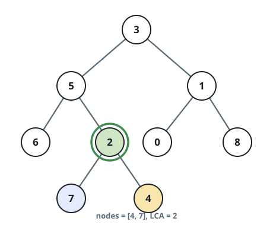
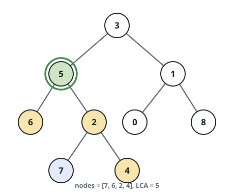

# Lowest Common Ancestor of a Binary Tree IV

## Description

Given the `root` of a binary tree and an array of node values `nodes`,
return the value of the lowest common ancestor (LCA) of all the nodes in
`nodes`. All the nodes will exist in the tree, and all values of the
tree's nodes are unique.

Extending the definition of LCA on Wikipedia: "The lowest common
ancestor of n nodes p1, p2, ..., pn in a binary tree T is the lowest
node that has every pi as a descendant (where we allow a node to be a
descendant of itself) for every valid i". A descendant of a node x is a
node y that is on the path from node x to some leaf node.

On LeetCode, `nodes` arrives as an array of node objects and the LCA is
returned as a node object; here the tree crosses the wire as a
level-order array, so nodes are identified by their values — unique
throughout the tree — and the returned node crosses the wire as its own
value.

### Example 1



```text
Input: root = [3,5,1,6,2,0,8,null,null,7,4], nodes = [4,7]
Output: 2
Explanation: The lowest common ancestor of nodes 4 and 7 is node 2.
```

### Example 2


```text
Input: root = [3,5,1,6,2,0,8,null,null,7,4], nodes = [1]
Output: 1
Explanation: The lowest common ancestor of a single node is the node
itself.
```

### Example 3



```text
Input: root = [3,5,1,6,2,0,8,null,null,7,4], nodes = [7,6,2,4]
Output: 5
Explanation: The lowest common ancestor of the nodes 7, 6, 2, and 4 is
node 5.
```

### Constraints

- The number of nodes in the tree is in the range `[1, 10⁴]`.
- `-10⁹ <= Node.val <= 10⁹`
- All `Node.val` are unique.
- All `nodes[i]` will exist in the tree.
- All `nodes[i]` are distinct.

## Hints

### Hint 1

Starting from the root, traverse the left and the right subtrees,
checking if one of the nodes exist there.

### Hint 2

If one of the subtrees doesn't contain any given node, the LCA can be
the node returned from the other subtree.

### Hint 3

If both subtrees contain nodes, the LCA node is the current node.
