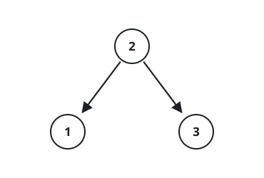

# Number Of Ways To Reconstruct A Tree

## Description

You are given an array `pairs`, where `pairs[i] = [x_i, y_i]`, and:

- There are no duplicates.
- `x_i < y_i`

Let `ways` be the number of rooted trees that satisfy the following
conditions:

- The tree consists of nodes whose values appeared in `pairs`.
- A pair `[x_i, y_i]` exists in `pairs` if and only if `x_i` is an ancestor
  of `y_i` or `y_i` is an ancestor of `x_i`.
- The tree does not have to be a binary tree.

Two ways are considered to be different if there is at least one node that
has different parents in both ways.

Return:

- `0` if `ways == 0`
- `1` if `ways == 1`
- `2` if `ways > 1`

A rooted tree is a tree that has a single root node, and all edges are
oriented to be outgoing from the root.

An ancestor of a node is any node on the path from the root to that node
(excluding the node itself). The root has no ancestors.

### Example 1



```text
Input: pairs = [[1,2],[2,3]]
Output: 1
Explanation: There is exactly one valid rooted tree: node 2 at the root,
with 1 and 3 as its children.
```

### Example 2


```text
Input: pairs = [[1,2],[2,3],[1,3]]
Output: 2
Explanation: There are multiple valid rooted trees. Every node must be an
ancestor or a descendant of every other, so each of the three nodes can sit
at the root with the other two chained below it, in either order.
```

### Example 3

```text
Input: pairs = [[1,2],[2,3],[2,4],[1,5]]
Output: 0
Explanation: There are no valid rooted trees.
```

### Constraints

- `1 <= pairs.length <= 10⁵`
- `1 <= x_i < y_i <= 500`
- The elements in `pairs` are unique.

## Hints

### Hint 1

Think inductively. The first step is to get the root. Obviously, the root
should be in pairs with all the nodes. If there isn't exactly one such node,
then there are 0 ways.

### Hint 2

The number of pairs involving a node must be less than or equal to that
number of its parent.

### Hint 3

Actually, if it's equal, then there is not exactly 1 way, because they can
be swapped.

### Hint 4

Recursively, given a set of nodes, get the node with the most pairs, then
this must be a root and have no parents in the current set of nodes.
