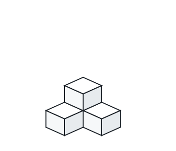
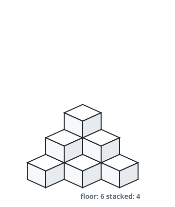

# Building Boxes

## Description

You have a cubic storeroom where the width, length, and height of the room
are all equal to `n` units. You are asked to place `n` boxes in this room
where each box is a cube of unit side length. There are, however, some
rules to placing the boxes:

- You can place the boxes anywhere on the floor.
- If box `x` is placed on top of the box `y`, then each side of the four
  vertical sides of the box `y` must either be adjacent to another box or
  to a wall.

Given an integer `n`, return the minimum possible number of boxes touching
the floor.

### Example 1


```text
Input: n = 3
Output: 3
Explanation: Two floor boxes never allow a third on top — even in a corner,
a floor box still has two vertical sides facing open floor — so all three
boxes sit on the floor in the corner.
```

### Example 2



```text
Input: n = 4
Output: 3
Explanation: Three boxes form an L in a corner, two along one wall and one
against the other. The fourth sits on the corner box, whose four vertical
sides now each touch a box or a wall.
```

### Example 3



```text
Input: n = 10
Output: 6
Explanation: Six boxes form a triangular corner footprint with rows of 3,
2 and 1, and the remaining four stack above it in a two-step pile.
```

### Constraints

- `1 <= n <= 10⁹`

## Hints

### Hint 1

Suppose we can put `m` boxes on the floor. Out of all the ways to place
the boxes, what is the maximum number of boxes we can put in?

### Hint 2

The first box should always start in the corner.
