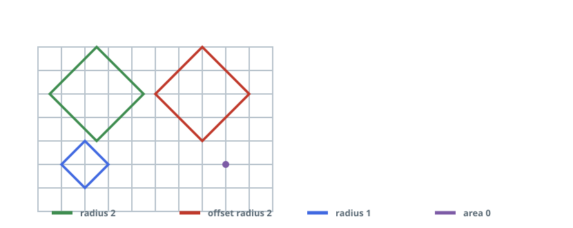
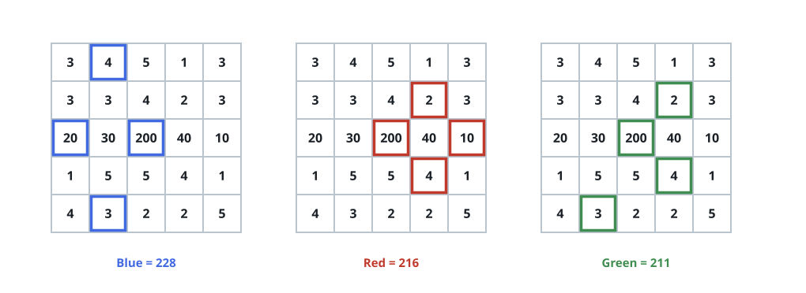
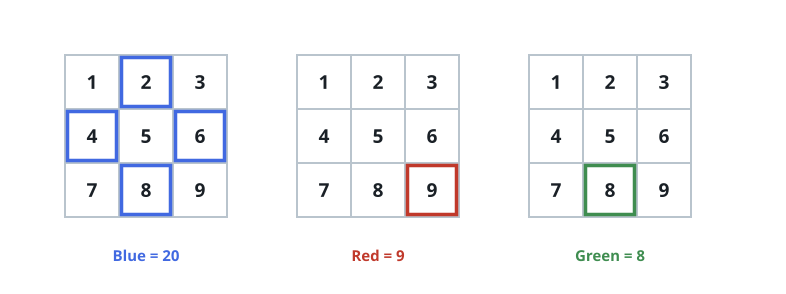

# Get Biggest Three Rhombus Sums in a Grid

## Description

You are given an `m x n` integer matrix `grid`.

A rhombus sum is the sum of the elements that form the border of a
regular rhombus shape in `grid`. The rhombus must have the shape of a
square rotated 45 degrees with each of the corners centered in a grid
cell.

Note that the rhombus can have an area of 0 — a single cell, whose
rhombus sum is that cell's value alone.

Return the biggest three distinct rhombus sums in the grid in descending
order. If there are less than three distinct values, return all of them.



### Example 1



```text
Input: grid = [[3,4,5,1,3],[3,3,4,2,3],[20,30,200,40,10],
               [1,5,5,4,1],[4,3,2,2,5]]
Output: [228,216,211]
Explanation: The three biggest distinct rhombus sums come from borders
of the rotated squares drawn around the center of the grid:
- Blue: 20 + 3 + 200 + 5 = 228
- Red: 200 + 2 + 10 + 4 = 216
- Green: 5 + 200 + 4 + 2 = 211
```

### Example 2



```text
Input: grid = [[1,2,3],[4,5,6],[7,8,9]]
Output: [20,9,8]
Explanation: The three biggest distinct rhombus sums are:
- Blue: 4 + 2 + 6 + 8 = 20 (border of the big rhombus)
- Red: 9 (area 0 rhombus in the bottom right corner)
- Green: 8 (area 0 rhombus in the bottom middle)
```

### Example 3

```text
Input: grid = [[7,7,7]]
Output: [7]
Explanation: All three possible rhombus sums are the same, so return
[7].
```

### Constraints

- `m == grid.length`
- `n == grid[i].length`
- `1 <= m, n <= 50`
- `1 <= grid[i][j] <= 10⁵`

## Hints

### Hint 1

You need to maintain only the biggest 3 distinct sums

### Hint 2

The limits are small enough for you to iterate over all rhombus sizes
then iterate over all possible borders to get the sums
