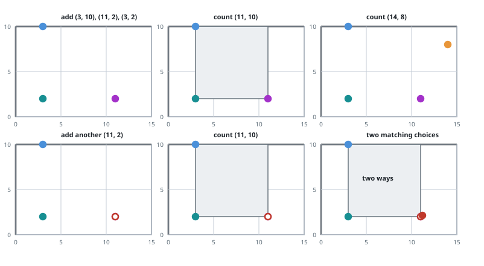

# Detect Squares

## Description

You are given a stream of points on the X-Y plane. Design an algorithm that:

- Adds new points from the stream into a data structure. Duplicate points are
  allowed and should be treated as different points.
- Given a query point, counts the number of ways to choose three points from
  the data structure such that the three points and the query point form an
  axis-aligned square with positive area.

An axis-aligned square is a square whose edges are all the same length and are
either parallel or perpendicular to the x-axis and y-axis.

Implement the `DetectSquares` class:

- `DetectSquares()` initializes the object with an empty data structure.
- `void add(int[] point)` adds a new point `point = [x, y]` to the data
  structure.
- `int count(int[] point)` counts the number of ways to form axis-aligned
  squares with `point = [x, y]` as described above.

### Example 1



```text
Input:
["DetectSquares", "add", "add", "add", "count", "count", "add", "count"]
[[], [[3,10]], [[11,2]], [[3,2]], [[11,10]], [[14,8]], [[11,2]], [[11,10]]]
Output: [null, null, null, null, 1, 0, null, 2]
Explanation:
DetectSquares detectSquares = new DetectSquares();
detectSquares.add([3,10]);
detectSquares.add([11,2]);
detectSquares.add([3,2]);
detectSquares.count([11,10]); // return 1 using the first three stored points
detectSquares.count([14,8]);  // return 0 because no square can be formed
detectSquares.add([11,2]);    // duplicate points are allowed
detectSquares.count([11,10]); // return 2 because either copy of [11,2] can be chosen
```

### Constraints

- `point.length == 2`
- `0 <= x, y <= 1000`
- At most `3000` calls in total will be made to `add` and `count`.

## Hints

### Hint 1

Maintain the frequency of all the points in a hash map.

### Hint 2

Traverse the hash map and if any point has the same y-coordinate as the query
point, consider this point and the query point to form one of the horizontal
lines of the square.
