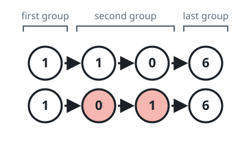

# Reverse Nodes in Even Length Groups

## Description

You are given the head of a linked list.

The nodes in the linked list are sequentially assigned to non-empty groups whose lengths form the sequence of the natural numbers (1, 2, 3, 4, ...). The length of a group is the number of nodes assigned to it. In other words,

- The 1st node is assigned to the first group.
- The 2nd and the 3rd nodes are assigned to the second group.
- The 4th, 5th, and 6th nodes are assigned to the third group, and so on.

Note that the length of the last group may be less than or equal to 1 + the length of the second to last group.

Reverse the nodes in each group with an even length, and return the head of the modified linked list.

### Example 1


```text
Input: head = [5,2,6,3,9,1,7,3,8,4]
Output: [5,6,2,3,9,1,4,8,3,7]
Explanation:
- The length of the first group is 1, which is odd, hence no reversal occurs.
- The length of the second group is 2, which is even, hence the nodes are reversed.
- The length of the third group is 3, which is odd, hence no reversal occurs.
- The length of the last group is 4, which is even, hence the nodes are reversed.
```

### Example 2



```text
Input: head = [1,1,0,6]
Output: [1,0,1,6]
Explanation:
- The length of the first group is 1. No reversal occurs.
- The length of the second group is 2. The nodes are reversed.
- The length of the last group is 1. No reversal occurs.
```

### Example 3


```text
Input: head = [1,1,0,6,5]
Output: [1,0,1,5,6]
Explanation:
- The length of the first group is 1. No reversal occurs.
- The length of the second group is 2. The nodes are reversed.
- The length of the last group is 2. The nodes are reversed.
```

### Constraints

- The number of nodes in the list is in the range `[1, 10⁵]`.
- `0 <= Node.val <= 10⁵`

## Hints

### Hint 1

Consider the list structure ...A → (B → ... → C) → D..., where the nodes between B and C (inclusive) form a group, A is the last node of the previous group, and D is the first node of the next group. How can you utilize this structure?

### Hint 2

Suppose you have B → ... → C reversed (because it was of even length) so that it is now C → ... → B. What references do you need to fix so that the transitions between the previous, current, and next groups are correct?

### Hint 3

A.next should be set to C, and B.next should be set to D.

### Hint 4

Once the current group is finished being modified, you need to find the new A, B, C, and D nodes for the next group. How can you use the old A, B, C, and D nodes to find the new ones?

### Hint 5

The new A is either the old B or old C depending on if the group was of even or odd length. The new B is always the old D. The new C and D can be found based on the new B and the next group's length.

### Hint 6

You can set the initial values of A, B, C, and D to A = null, B = head, C = head, D = head.next. Repeat the steps from the previous hints until D is null.
