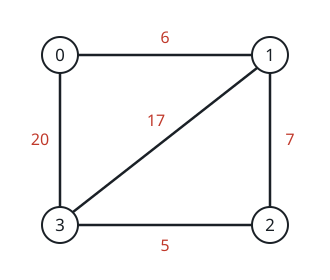

# Minimum Cost to Reach City With Discounts

## Description

A series of highways connect n cities numbered from 0 to n - 1. You are given a 2D integer array highways where highways[i] = [city1ᵢ, city2ᵢ, tollᵢ] indicates that there is a highway that connects city1ᵢ and city2ᵢ, allowing a car to go from city1ᵢ to city2ᵢ and vice versa for a cost of tollᵢ.

You are also given an integer discounts which represents the number of discounts you have. You can use a discount to travel across the ith highway for a cost of tollᵢ / 2 (integer division). Each discount may only be used once, and you can only use at most one discount per highway.

Return the minimum total cost to go from city 0 to city n - 1, or -1 if it is not possible to go from city 0 to city n - 1.

### Example 1


```text
Input: n = 5, highways = [[0,1,4],[2,1,3],[1,4,11],[3,2,3],[3,4,2]], discounts = 1
Output: 9
Explanation:
Go from 0 to 1 for a cost of 4.
Go from 1 to 4 and use a discount for a cost of 11 / 2 = 5.
The minimum cost to go from 0 to 4 is 4 + 5 = 9.
```

### Example 2



```text
Input: n = 4, highways = [[1,3,17],[1,2,7],[3,2,5],[0,1,6],[3,0,20]], discounts = 20
Output: 8
Explanation:
Go from 0 to 1 and use a discount for a cost of 6 / 2 = 3.
Go from 1 to 2 and use a discount for a cost of 7 / 2 = 3.
Go from 2 to 3 and use a discount for a cost of 5 / 2 = 2.
The minimum cost to go from 0 to 3 is 3 + 3 + 2 = 8.
```

### Example 3


```text
Input: n = 4, highways = [[0,1,3],[2,3,2]], discounts = 0
Output: -1
Explanation:
It is impossible to go from 0 to 3 so return -1.
```

### Constraints

- `2 <= n <= 1000`
- `1 <= highways.length <= 1000`
- `highways[i].length == 3`
- `0 <= city1ᵢ, city2ᵢ <= n - 1`
- `city1ᵢ != city2ᵢ`
- `0 <= tollᵢ <= 10⁵`
- `0 <= discounts <= 500`
- There are no duplicate highways.

## Hints

### Hint 1

Try to construct a graph out of highways. What type of graph is this?

### Hint 2

We essentially need to find the minimum distance to get from node 0 to node n - 1 in an undirected weighted graph. What algorithm should we use to do this?

### Hint 3

Use Dijkstra's algorithm to find the minimum weight path. Keep track of the minimum distance to each vertex with d discounts left
