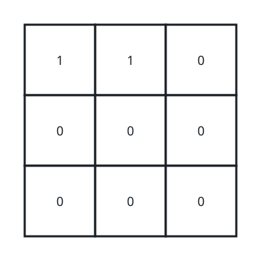

# Remove All Ones With Row and Column Flips

## Description

You are given an `m x n` binary matrix `grid`.

In one operation, you can choose any row or column and flip each value in that row or column (i.e., changing all `0`'s to `1`'s, and all `1`'s to `0`'s).

Return `true` if it is possible to remove all `1`'s from `grid` using any number of operations or `false` otherwise.

### Example 1


```text
Input: grid = [[0,1,0],[1,0,1],[0,1,0]]
Output: true
Explanation: One possible way to remove all 1's from grid is to:
- Flip the middle row
- Flip the middle column
```

### Example 2



```text
Input: grid = [[1,1,0],[0,0,0],[0,0,0]]
Output: false
Explanation: It is impossible to remove all 1's from grid.
```

### Example 3


```text
Input: grid = [[0]]
Output: true
Explanation: There are no 1's in grid.
```

### Constraints

- `m == grid.length`
- `n == grid[i].length`
- `1 <= m, n <= 300`
- `grid[i][j]` is either `0` or `1`.

## Hints

### Hint 1

Does the order, in which you do the operations, matter?

### Hint 2

No, it does not. An element will keep its original value if the number of operations done on it is even and vice versa. This also means that doing more than 1 operation on the same row or column is unproductive.

### Hint 3

Try working backward, start with a matrix of all zeros and try to construct `grid` using operations.

### Hint 4

Start with operations on columns, after doing them what do you notice about each row?

### Hint 5

Each row is the exact same. If we then flip some rows, that leaves only two possible arrangements for each row: the same as the original or the opposite.
