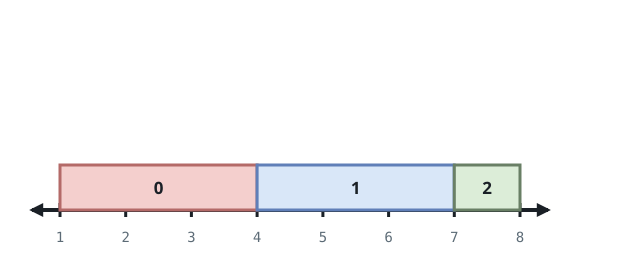
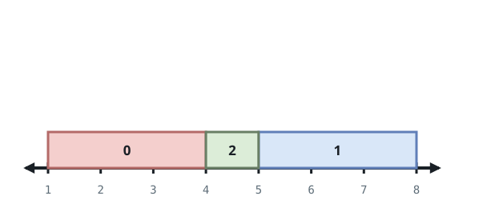
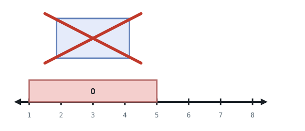

# Amount of New Area Painted Each Day

## Description

There is a long and thin painting that can be represented by a number line. You
are given a 0-indexed 2D integer array `paint` of length `n`, where
`paint[i] = [start_i, end_i]`. This means that on the `i`th day you need to
paint the area between `start_i` and `end_i`.

Painting the same area multiple times will create an uneven painting so you
only want to paint each area of the painting at most once.

Return an integer array `worklog` of length `n`, where `worklog[i]` is the
amount of new area that you painted on the `i`th day.

### Example 1



```text
Input: paint = [[1,4],[4,7],[5,8]]
Output: [3,3,1]
Explanation:
On day 0, paint everything between 1 and 4.
The amount of new area painted on day 0 is 4 - 1 = 3.
On day 1, paint everything between 4 and 7.
The amount of new area painted on day 1 is 7 - 4 = 3.
On day 2, paint everything between 7 and 8.
Everything between 5 and 7 was already painted on day 1.
The amount of new area painted on day 2 is 8 - 7 = 1.
```

### Example 2



```text
Input: paint = [[1,4],[5,8],[4,7]]
Output: [3,3,1]
Explanation:
On day 0, paint everything between 1 and 4.
The amount of new area painted on day 0 is 4 - 1 = 3.
On day 1, paint everything between 5 and 8.
The amount of new area painted on day 1 is 8 - 5 = 3.
On day 2, paint everything between 4 and 5.
Everything between 5 and 7 was already painted on day 1.
The amount of new area painted on day 2 is 5 - 4 = 1.
```

### Example 3



```text
Input: paint = [[1,5],[2,4]]
Output: [4,0]
Explanation:
On day 0, paint everything between 1 and 5.
The amount of new area painted on day 0 is 5 - 1 = 4.
On day 1, paint nothing because everything between 2 and 4 was already painted
on day 0.
The amount of new area painted on day 1 is 0.
```

### Constraints

- `1 <= paint.length <= 10⁵`
- `paint[i].length == 2`
- `0 <= start_i < end_i <= 5 * 10⁴`

## Hints

### Hint 1

What’s a good way to keep track of intervals that you have already painted?

### Hint 2

Create an array of all 1’s, and when you have painted an interval, set the
values in that interval to 0.

### Hint 3

Using this array, how can you quickly calculate the amount of new area that you
paint on a given day?

### Hint 4

Calculate the sum of the new array in the interval that you paint.
