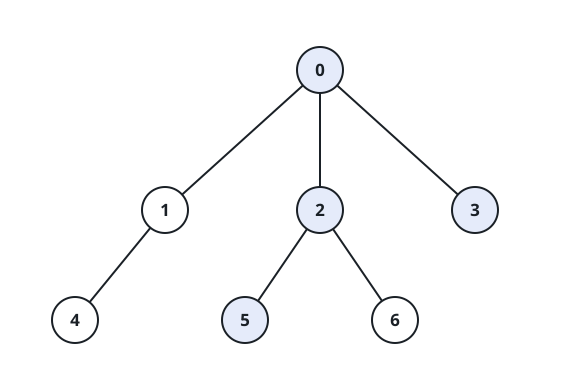

# Closest Node to Path in Tree

## Description

You are given a positive integer n representing the number of nodes in a
tree, numbered from 0 to n - 1 (inclusive). You are also given a 2D integer
array edges of length n - 1, where edges[i] = [node1i, node2i] denotes that
there is a bidirectional edge connecting node1i and node2i in the tree.

You are given a 0-indexed integer array query of length m where
query[i] = [starti, endi, nodei] means that for the ith query, you are
tasked with finding the node on the path from starti to endi that is
closest to nodei.

Return an integer array answer of length m, where answer[i] is the answer
to the ith query.

### Example 1



```text
Input: n = 7, edges = [[0,1],[0,2],[0,3],[1,4],[2,5],[2,6]], query = [[5,3,4],[5,3,6]]
Output: [0,2]
Explanation:
The path from node 5 to node 3 consists of the nodes 5, 2, 0, and 3.
The distance between node 4 and node 0 is 2.
Node 0 is the node on the path closest to node 4, so the answer to the first query is 0.
The distance between node 6 and node 2 is 1.
Node 2 is the node on the path closest to node 6, so the answer to the second query is 2.
```

### Example 2


```text
Input: n = 3, edges = [[0,1],[1,2]], query = [[0,1,2]]
Output: [1]
Explanation:
The path from node 0 to node 1 consists of the nodes 0, 1.
The distance between node 2 and node 1 is 1.
Node 1 is the node on the path closest to node 2, so the answer to the first query is 1.
```

### Example 3


```text
Input: n = 3, edges = [[0,1],[1,2]], query = [[0,0,0]]
Output: [0]
Explanation:
The path from node 0 to node 0 consists of the node 0.
Since 0 is the only node on the path, the answer to the first query is 0.
```

### Constraints

- `1 <= n <= 1000`
- `edges.length == n - 1`
- `edges[i].length == 2`
- `0 <= node1i, node2i <= n - 1`
- `node1i != node2i`
- `1 <= query.length <= 1000`
- `query[i].length == 3`
- `0 <= starti, endi, nodei <= n - 1`
- The graph is a tree.

## Hints

### Hint 1

For the ith query, find the distance from node_i to every other node in
the tree.

### Hint 2

We can use a BFS to find the distances.

### Hint 3

Use DFS to find all the nodes on the path from start_i to end_i.
