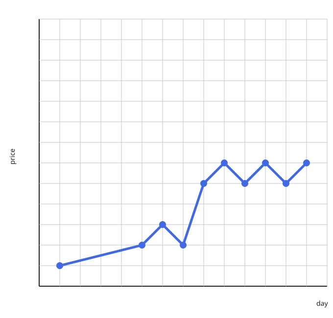
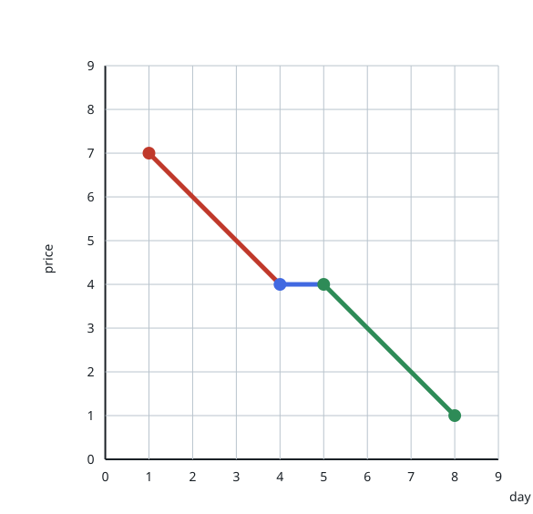
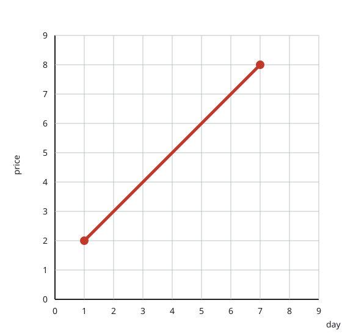

# Minimum Lines to Represent a Line Chart

## Description

You are given a 2D integer array stockPrices where stockPrices[i] =
[dayi, pricei] indicates the price of the stock on day dayi is pricei. A line
chart is created from the array by plotting the points on an XY plane with the
X-axis representing the day and the Y-axis representing the price and
connecting adjacent points. One such example is shown below:



Return the minimum number of lines needed to represent the line chart.

### Example 1



```text
Input: stockPrices = [[1,7],[2,6],[3,5],[4,4],[5,4],[6,3],[7,2],[8,1]]
Output: 3
Explanation:
The diagram above represents the input, with the X-axis representing the day and Y-axis representing the price.
The following 3 lines can be drawn to represent the line chart:
- Line 1 (in red) from (1,7) to (4,4) passing through (1,7), (2,6), (3,5), and (4,4).
- Line 2 (in blue) from (4,4) to (5,4).
- Line 3 (in green) from (5,4) to (8,1) passing through (5,4), (6,3), (7,2), and (8,1).
It can be shown that it is not possible to represent the line chart using less than 3 lines.
```

### Example 2



```text
Input: stockPrices = [[3,4],[1,2],[7,8],[2,3]]
Output: 1
Explanation:
As shown in the diagram above, the line chart can be represented with a single line.
```

### Constraints

- `1 <= stockPrices.length <= 10⁵`
- `stockPrices[i].length == 2`
- `1 <= dayi, pricei <= 10⁹`
- All `dayi` are distinct.

## Hints

### Hint 1

When will three adjacent points lie on the same line? How can we generalize this for all points?

### Hint 2

Will calculating the slope of lines connecting adjacent points help us find the answer?
