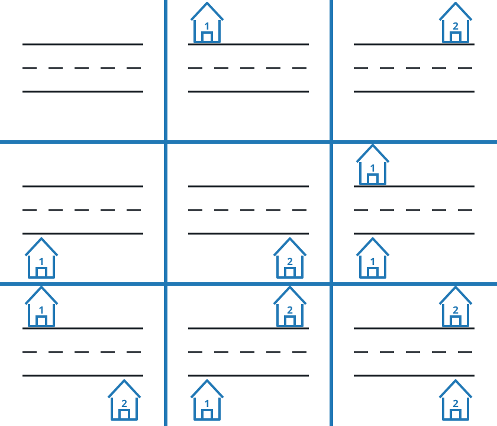

# Count Number of Ways to Place Houses

## Description

There is a street with n * 2 plots, where there are n plots on each side of
the street. The plots on each side are numbered from 1 to n. On each plot, a
house can be placed.

Return the number of ways houses can be placed such that no two houses are
adjacent to each other on the same side of the street. Since the answer may
be very large, return it modulo 10⁹ + 7.

Note that if a house is placed on the ith plot on one side of the street, a
house can also be placed on the ith plot on the other side of the street.

### Example 1

```text
Input: n = 1
Output: 4
Explanation:
Possible arrangements:
1. All plots are empty.
2. A house is placed on one side of the street.
3. A house is placed on the other side of the street.
4. Two houses are placed, one on each side of the street.
```

### Example 2



```text
Input: n = 2
Output: 9
Explanation: The 9 possible arrangements are shown in the diagram above.
```

### Constraints

- `1 <= n <= 10⁴`

## Hints

### Hint 1

Try coming up with a DP solution for one side of the street.

### Hint 2

The DP for one side of the street will bear resemblance to the Fibonacci
sequence.

### Hint 3

The number of different arrangements on both side of the street is the same.
