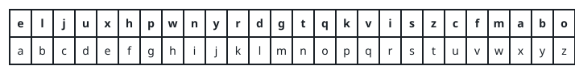

# Decode the Message

## Description

You are given the strings `key` and `message`, which represent a cipher key
and a secret message, respectively. The steps to decode `message` are as
follows:

- Use the first appearance of all 26 lowercase English letters in `key` as
  the order of the substitution table.
- Align the substitution table with the regular English alphabet.
- Each letter in `message` is then substituted using the table.
- Spaces `' '` are transformed to themselves.

For example, given `key = "happy boy"` (actual key would have at least one
instance of each letter in the alphabet), we have the partial substitution
table of ('h' -> 'a', 'a' -> 'b', 'p' -> 'c', 'y' -> 'd', 'b' -> 'e',
'o' -> 'f').

Return the decoded `message`.

### Example 1


```text
Input: key = "the quick brown fox jumps over the lazy dog", message = "vkbs bs t suepuv"
Output: "this is a secret"
Explanation: The diagram above shows the substitution table.
It is obtained by taking the first appearance of each letter in "the quick brown fox jumps over the lazy dog".
```

### Example 2



```text
Input: key = "eljuxhpwnyrdgtqkviszcfmabo", message = "zwx hnfx lqantp mnoeius ycgk vcnjrdb"
Output: "the five boxing wizards jump quickly"
Explanation: The diagram above shows the substitution table.
It is obtained by taking the first appearance of each letter in "eljuxhpwnyrdgtqkviszcfmabo".
```

### Constraints

- `26 <= key.length <= 2000`
- `key` consists of lowercase English letters and `' '`.
- `key` contains every letter in the English alphabet ('a' to 'z') at least
  once.
- `1 <= message.length <= 2000`
- `message` consists of lowercase English letters and `' '`.

## Hints

### Hint 1

Iterate through the characters in the key to construct a mapping to the English alphabet.

### Hint 2

Make sure to check that the current character is not already in the mapping (only the first appearance is considered).

### Hint 3

Map the characters in the message according to the constructed mapping.
