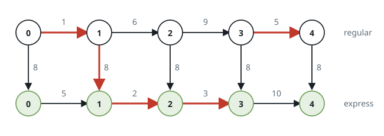
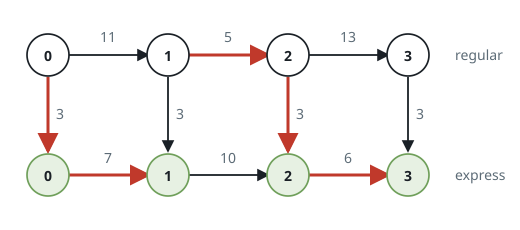

# Minimum Costs Using the Train Line

## Description

A train line going through a city has two routes, the regular route and the
express route. Both routes go through the same `n + 1` stops labeled from `0`
to `n`. Initially, you start on the regular route at stop `0`.

You are given two 1-indexed integer arrays `regular` and `express`, both of
length `n`. `regular[i]` describes the cost it takes to go from stop `i - 1`
to stop `i` using the regular route, and `express[i]` describes the cost it
takes to go from stop `i - 1` to stop `i` using the express route.

You are also given an integer `expressCost` which represents the cost to
transfer from the regular route to the express route.

Note:

- There is no cost to transfer from the express route back to the regular
  route.
- You pay `expressCost` every time you transfer from the regular route to
  the express route.
- There is no extra cost to stay on the express route.

Return a 1-indexed array `costs` of length `n`, where `costs[i]` is the
minimum cost to reach stop `i` from stop `0`.

Note that a stop can be counted as reached from either route.

### Example 1



```text
Input: regular = [1,6,9,5], express = [5,2,3,10], expressCost = 8
Output: [1,7,14,19]
Explanation:
- Take the regular route from stop 0 to stop 1, costing 1.
- Take the express route from stop 1 to stop 2, costing 8 + 2 = 10.
- Take the express route from stop 2 to stop 3, costing 3.
- Take the regular route from stop 3 to stop 4, costing 5.
The total cost is 1 + 10 + 3 + 5 = 19.
Note that a different route could be taken to reach the other stops with
minimum cost.
```

### Example 2



```text
Input: regular = [11,5,13], express = [7,10,6], expressCost = 3
Output: [10,15,24]
Explanation:
- Take the express route from stop 0 to stop 1, costing 3 + 7 = 10.
- Take the regular route from stop 1 to stop 2, costing 5.
- Take the express route from stop 2 to stop 3, costing 3 + 6 = 9.
The total cost is 10 + 5 + 9 = 24.
Note that the expressCost is paid again to transfer back to the express
route.
```

### Constraints

- `1 <= n == regular.length == express.length <= 10⁵`
- `1 <= regular[i], express[i], expressCost <= 10⁵`

## Hints

### Hint 1

Notice and evaluate the different ways there are to move from one stop to
the next.

### Hint 2

From the express route at a previous stop, we can use either the express
route or the regular route to the next stop without paying expressCost.

### Hint 3

From the regular route at a previous stop, we can either use the express
route after paying expressCost or use the regular route without paying
expressCost.

### Hint 4

Iterate through the stops and compare the above cases to obtain the minimum
costs for each stop.
